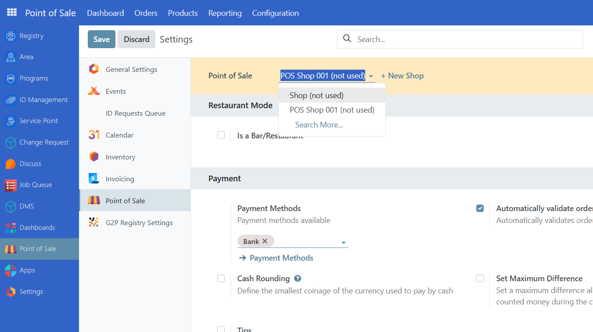
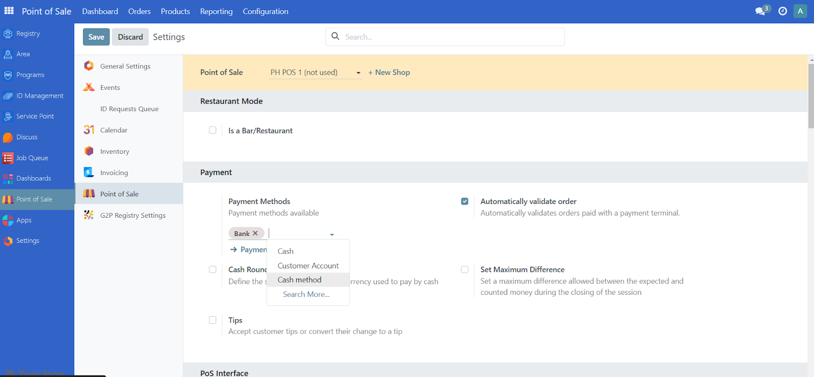
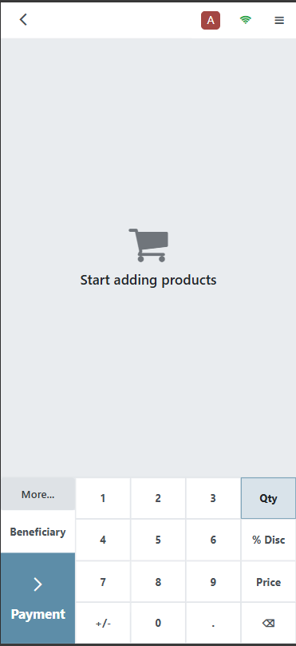
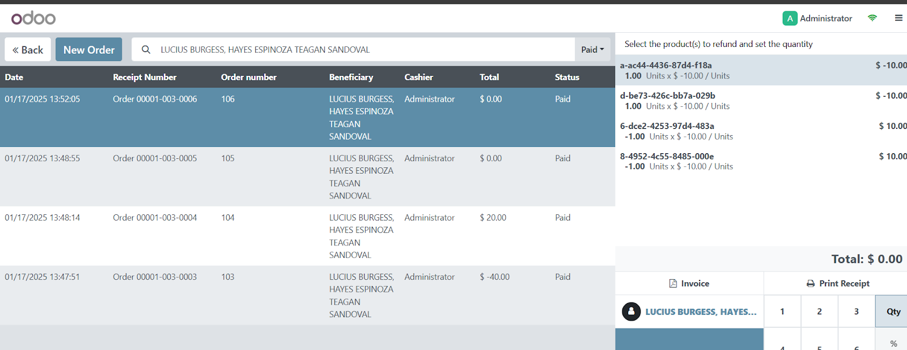

---
myst:
  html_meta:
    "title": "Point of Sales (POS) system usage"
    "description": "Learn how to configure and use the OpenSPP Point of Sales system for beneficiary transactions, including web and mobile interfaces, refunds, and area grouping."
    "keywords": "OpenSPP, Point of Sales, POS, beneficiary transactions, cash disbursement, refunds, mobile POS"
---

# Point of Sales

In this tutorial, you will learn about the POS feature, covering configuration, creating point of sales, and setting it by area.

## Prerequisites

To utilise this feature, you need the following:

- Make sure that both modules **OpenSPP POS: ID Redemption** and **OpenSPP POS** are installed and activated.
  For details on installing additional modules, refer to the {doc}`../../getting_started/module_installation` documentation.
- Have existing individual records in your registry, either by creating records manually or importing records into OpenSPP.
- Have an access role either as **System Admin** or **POS operator** to perform tasks in the POS application.
- Have an access role as **System Admin** to perform tasks in OpenSPP.
  Learn more about assigning user role in the guide {doc}`administration/user_access`.
- Have an existing cycle with beneficiaries and entitlements generated on a program.
  Learn more about this in the guide {doc}`program_management/create_program`.

## Objective

By the end of this tutorial, you will be able to configure point of sales, manage, classify by area, and generate transactions within the POS feature.

## Process

### Verify POS module

To be able to create point of sales, you have to make sure that the necessary modules are installed and activated on your OpenSPP instance.
This can be verified by logging in to your OpenSPP instance as Administrator, go to **Apps**, search for **OpenSPP POS** and **OpenSPP POS: ID Redemption** respectively and if not already done, activate them by clicking **Activate** button.

Upon successful activation, the button label should change to **Learn more**.

### Configure POS Settings

Navigate to the menu screen.
On the sidebar menu, click **Point of Sale** to open the POS dashboard.

Click on **Configuration** and select **Payment methods** to see the payment methods available.
By default, the options **Cash**, **Bank** and **Customer Account** are available.

#### Create point of sales

To create a point of sale, click on **Point of Sales** from the sidebar, click **Configuration** and select **Point of Sales**, then click on **New**.

Assign a name to the point of sale you want to create.
It is also possible to assign the shop to a specific area by selecting the desired area from the dropdown.
Click on **Save** button to keep the changes.

#### Select payment methods

To select a payment method for your point of sale, click on **Point of Sales** from the sidebar, navigate to **Configuration** and click on **Settings**.
From the **Point of Sale** dropdown, click and select the point of sale you want to manage.

Once you have selected a point of sale, click on the dropdown from **Payment methods** and select the desired payment methods for this point of sale.
Click the **Save** button to keep the changes.

Please Note: For **Cash** payment method a unique payment method needs to be created for each point of sale.
In order to create a new **Cash** payment method, navigate to **Point of Sale**, click on **Configuration** and select **Payment methods**, then click **New**.

Define the name of the payment method and click on the Journal Input field.

Click on **Search More** from the dropdown.

Click on **New** button.

Define the **Journal name**, then select **Cash** under **Type** dropdown.
To complete the journal creation, click **Save & Close**.

You may now select the new Cash payment method for a point of sale.
Navigate to **Configuration** and click on **Settings**.
Select a **Point of sale**.
Then under payment methods dropdown, select your new Cash payment method and click **Save**.

#### Group point of sales by area

In order to group point of sales by area, make sure you have areas already existing in your OpenSPP instance.
Learn more about importing areas in the guide {doc}`administration/import_areas`.
From the sidebar, navigate to **Point of Sale**, select **Configuration** and click **Point of Sales**.
Select the point of sale you wish to manage and assign by clicking an area from the dropdown **Area**.

Navigate to **Point of Sale** and select **Dashboard**.
The point of sales will now be grouped by area.

Point of sales that do not belong to any area will display as minimized.
Click the **<>** arrows from the dashboard to expand the view.
Click on **Gear** icon to collapse view.

### Starting point of sale in web view

The POS application is viewable in either web view or mobile view.
This section will be covering the web view, for mobile view, proceed to **Starting point of sale in mobile view** of this document.

The POS application can be operated by either an **Administrator** or a **POS Operator** role.

To start the point of sale, click on **Point of Sale** in the sidebar.
You should be redirected to the **Dashboard**, where you can select the point of sale you wish to start.

Click on **New Session** to be redirected to the POS application, then click on **Beneficiary** to display the list of beneficiaries.

Click on the beneficiary you wish to transact with.

Once selected, the beneficiary's name will be displayed in the POS application.

Click on the **Entitlement** button to display all the entitlements available for this beneficiary.

Select the entitlement you wish to disburse by clicking on it.
Then click **Close** button.

Click on **Payment** button to proceed.

Click on **Validate** button to complete.

The transaction is now complete.
If you wish to start a new transaction, click on **New Order**.

### Starting point of sale in mobile view

The POS application is viewable in either web view or mobile view.
This section will cover the mobile view, for web view, proceed to **Starting point of sale in web view** of this document.

Click on the upper left box icon to bring up the menu, then click **Point of Sale**.

You will be taken to the **Dashboard**.
Select a point of sale you wish to start by swiping horizontally and click on **New Session**.

Click on **Review**.

Then click on **Beneficiary** to display a list of beneficiaries.

Click on the relevant beneficiary in the displayed list.

Once selected, the beneficiary's name is displayed in the POS application.

Click on **More** and then **Entitlement** to display available entitlements for this beneficiary.

Click on the entitlement you wish to disburse and click the **Close** button.

Optionally, you may add a note by clicking on **More** followed by **Beneficiary note**.
Fill in the note and click on **Add** button.
This note will be displayed on the receipt.

Click on the **Payment** button to proceed.

Click on the **Validate** button to complete.

The order or transaction is now complete.
Click on **New Order** to start a new transaction.

### Refunds

When necessary, it is possible to do refunds for cash entitlements.
To start a refund, click on a point of sale and select a beneficiary.
Click on **Refund**.

The orders/transactions associated with the beneficiary will be displayed.
Click on any transaction to view the details on the right side.

Click on an item.
You may only refund items that are disbursed, indicated by the negative (-) sign beside its amount.

Note that if an item has been already refunded, it will display **Refunded** and you will be unable to click it anymore.

Upon clicking the item, click **1** from the number pad key and then click on the **Refund** button.

The item to be refunded will be displayed on the menu.
Click on **Payment**.

Select a payment method and click **Validate**.
This completes the refund process.

To verify that the item was successfully refunded you can click on the burger menu on the top right corner of the screen.

Click on **Orders**.
You will be redirected to the screen below.
Click on **All active orders** and select **Paid**.

Click on the transaction that involves the refund and notice that the amount is now a positive value indicating that the cash entitlement has been successfully refunded.

