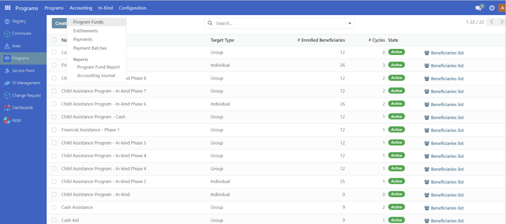
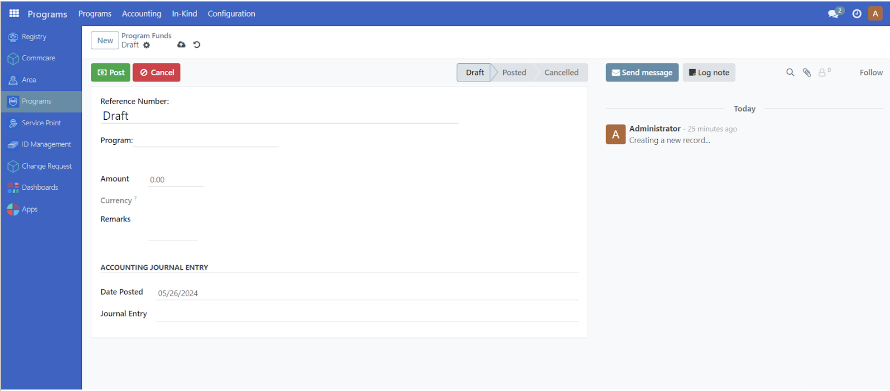
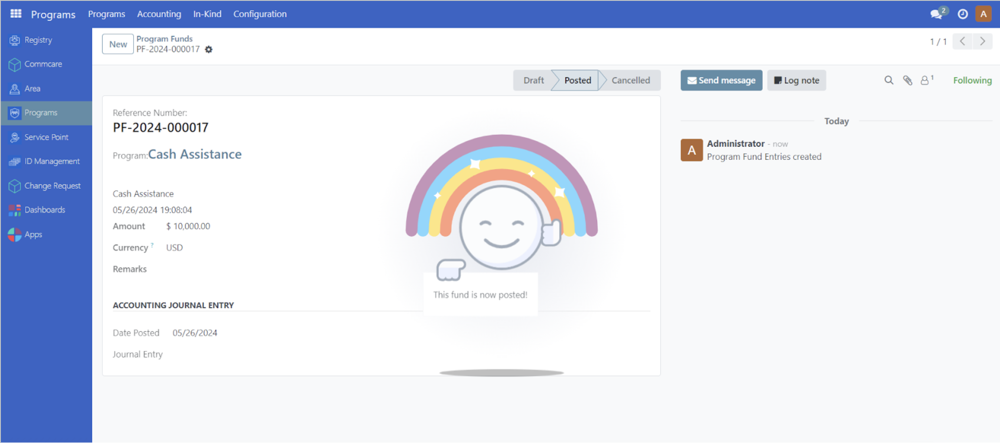

# Allocate funds

## Introduction

This tutorial covers the step-by-step procedure on how to allocate funds for a project.

## Prerequisites

To allocate funds for a project, you need to:

- Have a System administrator or the appropriate program user role that enables you to create programs and allocate funds. Learn more in this guide: {doc}`../administration/user_access`.
- Have existing individual records in your registry, either by creating records manually or importing records into OpenSPP. Learn more in this guide: {doc}`../registry_management/import_export_registrant_data` or {doc}`../registry_management/register_individual`.
- An existing Program where individuals are registered. Learn more in this guide: {doc}`create_program`.

## Objective

After completing this guide, the user will have learned how to allocate funds.

## Process

### Allocate funds to selected program

Entitlements require allocated funds in order to be successfully approved and it is therefore a prerequisite to configure the fund allocation for a selected program before generating cycles and entitlements.

After clicking **Programs**, select **Accounting** from the toolbar, and select **Program Funds** from the drop-down list.

You will be directed to the Program Funds page to set up the program fund.

When available, a reference number may be inputted manually into the **Reference Number** field. Otherwise, leaving this field empty will automatically set a reference number upon fund posting. From the **Program** dropdown, you may select by clicking on an existing program. Input the budget amount in the **Amount** input field. Click **Post** to confirm the fund posting.

A pop-up message should appear, verifying that the funds have been posted.

You may also modify the **Date Posted** field to post the funding on a later date. Click on **Date Posted** and select a future date. Skip clicking on the **Post** button, then click on **Save manually** button. The funds will be posted on the desired date inputted. Please note, clicking on the Post button automatically sets the **Date Posted** field to the current date.
