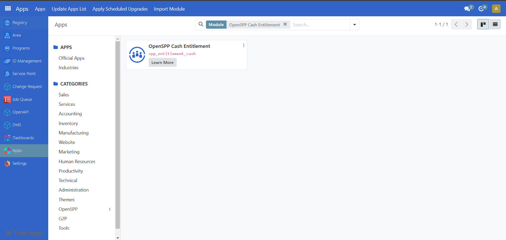
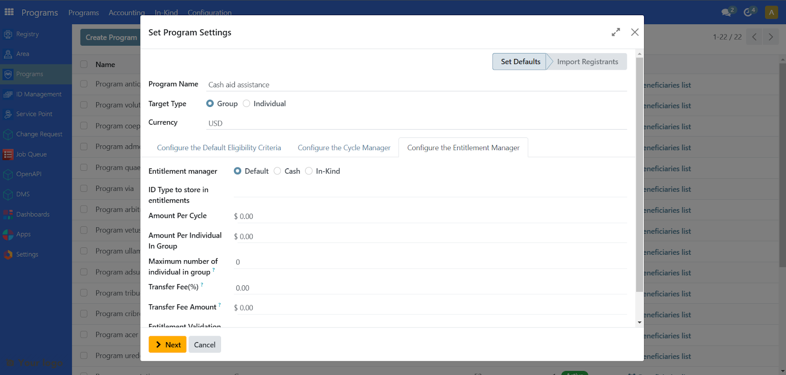
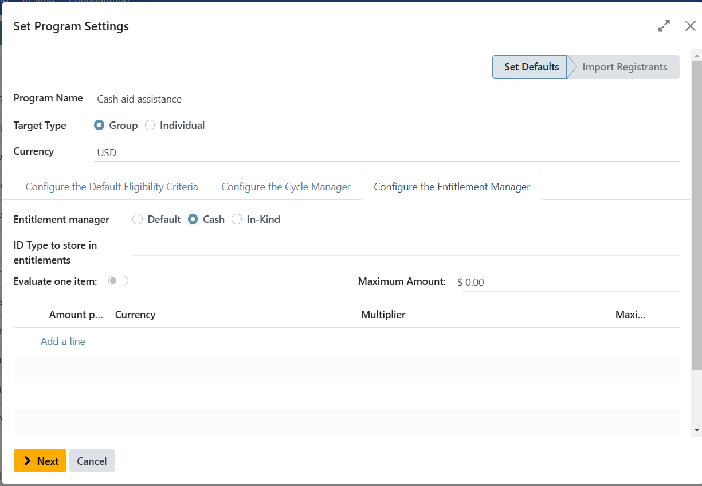
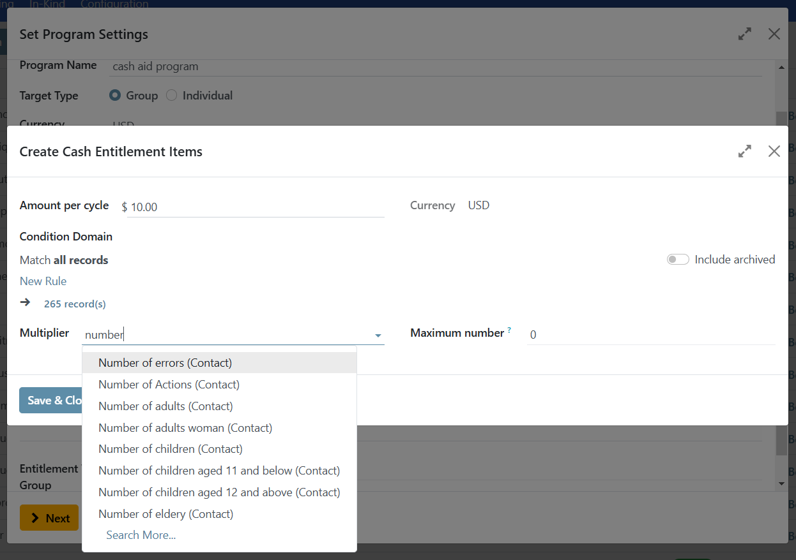
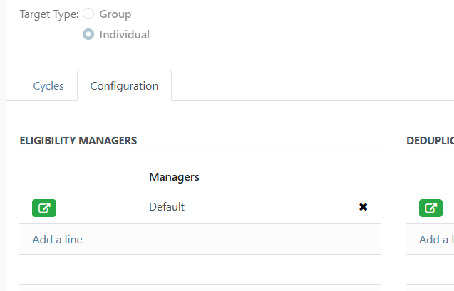
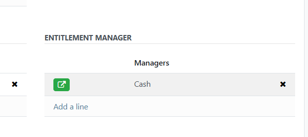
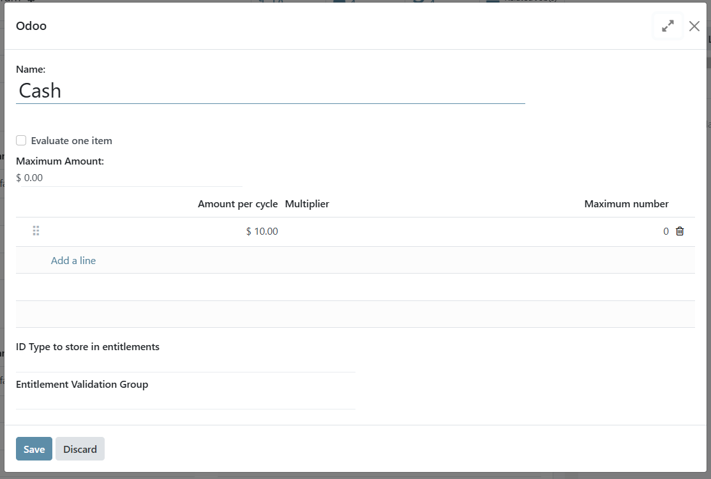
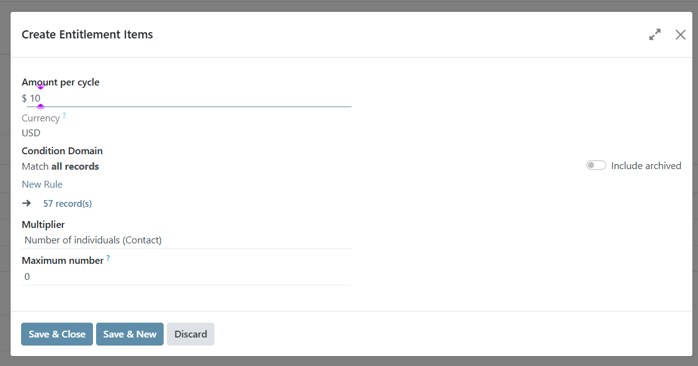
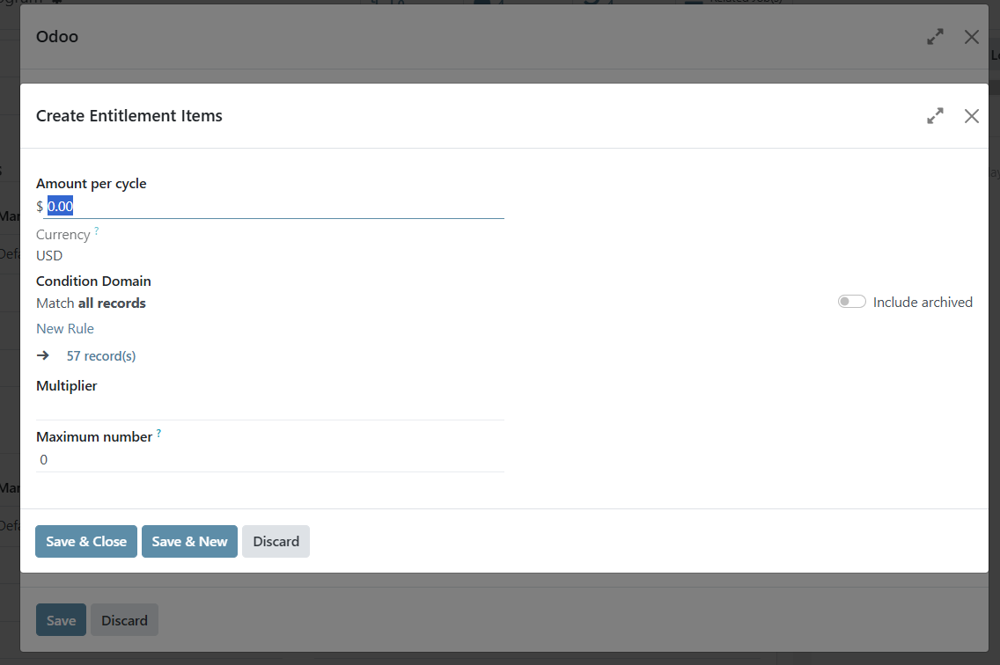

### Content from docs/tutorial/user_guides/configure_cash_entitlements.md

# Configure cash entitlements

## Introduction

This tutorial describes the steps of configuring cash entitlements when selected as Entitlement manager.

## Prerequisites

- Have an access role as an **Operations Admin** or **Administrator**. Learn more about this in the guide [Administrating role-based access](https://docs.openspp.org/tutorial/user_guides/administrating_role_based_access.html#)
- Install and activate the module: **OpenSPP Cash Entitlement** on your OpenSPP instance as **Administrator**.
- Create a Program or have an already existing program. Learn more about this in the guide [Create a social protection program](https://docs.openspp.org/tutorial/user_guides/create_social_protection_program.html)

## Objective

After completing this guide, you will be able to learn how to configure cash entitlements and edit existing cash entitlement configuration.

## Process

### Verify installed module

To be able to configure cash entitlements, you have to make sure the necessary module is installed and activated on your OpenSPP instance, you can verify this by logging in to your OpenSPP instance as Administrator, go to **Apps** and search for **OpenSPP Cash Entitlement**.

After successfully activating, the **Activate** button should disappear and it should display **Learn more** as the remaining button.

### Configure the Entitlement Manager

It is possible to configure cash entitlements either during creation of the program or after, both options are explained below.

#### Configure cash entitlements during program creation

When Creating a program, the tab **Configure the Entitlement manager** is available from the pop-up modal. Click on it to start setting it up.

Depending on installed modules there may be different options, or none, displayed. If there are options displayed, click on **Cash** as **Entitlement Manager**.

Click on **Add a line** to add an amount for your entitlement. Define the amount under **Amount per cycle**.

**Multiplier:** this dropdown field defines how many times the **Amount per cycle** will be multiplied. For example, if the indicator is set to **Number of adults** it would multiply the **Amount per cycle** by the number of adults in this group. The total amount will be the registrant’s entitlement.

**Maximum number:** this input field defines the maximum count for the multiplier. If, for example “Number of adults = 5” and “Maximum number= 3”, the **Amount** will be multiplied by 3 instead of 5.

In order to not have any limitations this field should be set to zero(0).

#### Edit after program creation

Once a program is created, you are still able to configure its settings by selecting the program and clicking on the tab **Configuration**.

Scroll down to the section **Entitlement manager**. Click on the green box to expand.

##### Deleting an Entitlement item

Click on the trash icon on the far right corner.

##### Modifying amount per cycle

Click on the Entitlement item to display another modal pop-up. Edit amount by replacing value under **Amount per cycle**.

**Multiplier:** this dropdown field defines how many times the **Amount per cycle** will be multiplied. For example, if the indicator is set to **Number of adults** it would multiply the **Amount per cycle** by the number of adults in this group. The total amount will be the registrant’s entitlement.

**Maximum number:** this input field defines the maximum count for the multiplier. If, for example “Number of adults = 5” and “Maximum number= 3”, the **Amount** will be multiplied by 3 instead of 5.

In order to not have any limitations this field should be set to zero(0).

##### Adding a cash entitlement

Click on **Add** a line and input the amount under **Amount per cycle**.

**Multiplier:** this dropdown field defines how many times the **Amount per cycle** will be multiplied. For example, if the indicator is set to **Number of adults** it would multiply the **Amount per cycle** by the number of adults in this group. The total amount will be the registrant’s entitlement.

**Maximum number:** this input field defines the maximum count for the multiplier. If, for example “Number of adults = 5” and “Maximum number= 3”, the **Amount** will be multiplied by 3 instead of 5.

In order to not have any limitations this field should be set to zero(0).

Click **Save and Close** to apply the changes.

Please note that the amount of the entitlements will be final once entitlements have been prepared in a cycle.
