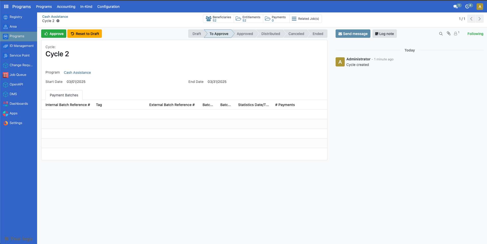
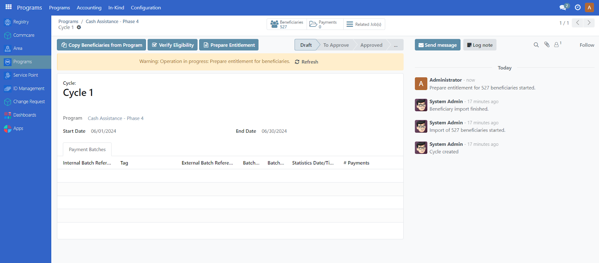

---
myst:
  html_meta:
    "title": "Create Cycles & Prepare Entitlements"
    "description": "Learn how to configure, create, and approve cycles and prepare entitlements for social protection programs in OpenSPP"
    "keywords": "OpenSPP, cycles, entitlements, program management, social protection, beneficiaries, approval workflow"
---

# Create cycles & prepare entitlements

In this tutorial, you will learn the process of configuring, creating, and approving cycles and preparing entitlements in OpenSPP.

## Prerequisites

To create a cycle and prepare entitlements in OpenSPP, you need to:

- Ensure your program is set and ready. Learn more about this in the documentation {doc}`create_program`.
- Enroll beneficiaries in the program. Learn more about this in the documentation {doc}`enrol_beneficiaries`.
- Allocate funds to the program. Learn more about this in the documentation {doc}`allocate_funds`.
- Ensure your user account have the appropriate user permissions, such as **Global Program manager**, or **System Admin** roles.
Learn more in this guide: {doc}`../administration/user_access`

## Objective

By the end of this tutorial, you will learn how to configure both new and existing cycles, manage entitlements, and allocate funds within OpenSPP.
You will also learn the importance of proper setup for cycle approval and entitlement management to ensure accurate and effective distribution of assistance.

## Process

To begin configuring cycles and preparing entitlements in OpenSPP, login into your OpenSPP account, then select an existing program.

Please note that any configuration changes made to your program will not impact cycles that have already been approved.
Such changes will only apply to cycles created after the modifications.
However, if you are already satisfied with the current program configurations, you may proceed to **Creating cycle** section of this document.

### Editing program configuration

Cycle configuration is initially performed during program creation, as detailed in the Configure the cycle manager section of {doc}`create_program`.
However, you may also update the cycle configuration for an existing program as needed.

Click on a program and navigate to the **Configuration** tab.

#### Eligibility managers

You can edit the eligibility manager by clicking on the green icon.

On the popup that appears, click on the **Admin Area** dropdown field to select the target area of the cycle.
You may also narrow down your criteria by clicking on **New Rule**.

The number indicated in **record(s)** represents the number of beneficiaries that qualify your criteria.
After configuring, click on the **Save** button to apply changes.

>The changes made will only be applied to existing cycles that are in **Draft** and **To Approve** state, it will not be applied to cycles that fall under **Ended** or **Approved** state.

To apply the latest eligibility changes for the cycles under **To Approve** state, it must first be set back to **Draft** state.
Click on the green button beside the cycle, then click on **Reset to Draft** button.
This resets the cycle back to **Draft** state.

To apply the latest eligibility changes for the cycles under **Draft** state, click on the green button beside the cycle then click on **Verify Eligibility** button.

The **Beneficiaries** count should be updated accordingly.

#### Cycle manager

You can edit the cycle manager by clicking on the green icon.

A popup is displayed. Make the necessary changes and then click **Save**.

See **Configure the cycle manager** section of the document [Create a social protection program](https://docs.openspp.org/tutorial/user_guides/create_social_protection_program.html) for more information on the displayed fields.

Please note that changes you made on **Auto-Approve entitlements** and **Approver Group** are only applicable to **New**, **Draft** or **To Approve** cycles, while changes made for **Recurrence** only apply to the **New** cycles created thereafter.
If you wish to edit the current recurrence of an already existing cycle, it must first be on **Draft** state.
Click on the green button beside the cycle, then on the popup menu, click on the **Start date** and **End date** of a program to modify.
Click on **Save** to apply changes.

#### Entitlement manager

You can edit the entitlement manager by clicking on the green icon.

A popup should appear.
Make the necessary changes and then click **Save**.

See Tutorial {doc}`configure_entitlements` to learn more on configuring cash entitlements.

Please note that changes you made into the following fields are only applied to newly prepared entitlements.

### Creating cycle

A cycle can only be created under a program.
If you do not have any existing programs yet, you may refer to this document {doc}`create_program`.

Select an existing program from the program table list.
You will be directed to the screen below.
Click **Create New Cycle** to generate a cycle for the program.

> Please note that during the creation of the program, if **One-time Distribution** was enabled, a single cycle will be automatically generated upon creation of the program and this program will not have any **Create New Cycle** button, as this program is meant to run with one cycle only.

Once a cycle is created, click on the green button beside it to open it.
You may click on the **Edit** button to change **Cycle name**, **Start date** and **End Date** fields.

If there were additional beneficiaries added into the program after this cycle was created, you may click on **Copy Beneficiaries from Program** to sync beneficiaries into this cycle.
The **Verify Eligibility** button is to check if beneficiaries enrolled would still qualify the criteria set for this cycle.

### Preparing entitlements

It is important to prepare entitlements for a cycle before a cycle is approved, as you will not be able to redo prepare entitlements anymore once the cycle has been approved.

Select the program you wish to act upon and click the green icon beside the cycle you wish to generate entitlements for.

Click on the **Prepare Entitlement** button.
Entitlements will be generated.

The number count on top of **Entitlements** indicates the amount of entitlements prepared for the enrolled beneficiaries.

**Note**: A yellow warning message appears if processes are still running.
If displayed, click **Refresh** within the yellow warning message.
Repeat every now and then until the yellow warning message disappears.
It is important to let the warning message resolve before proceeding into the next step as it might otherwise cause data discrepancy.

To verify the prepared entitlements, from the top section of the cycle page, click on **Entitlements** beside **Beneficiaries** to display a table of entitlements under **Draft** state.

Click further on an entitlement to show more details.

### Approving a cycle

After entitlements are prepared, the next step is to approve the cycle.
Please note that only the assigned user with correct access rights is able to approve cycles for the program.
This is set during the creation of the program, however it can also be changed in the **Approver group** dropdown within the cycle manager of the program configuration.

Login to OpenSPP with a user role to approve the cycle.
After clicking on the program, select a cycle to approve by clicking on the green button beside it, click on **To Approve** button.

>**Note:** If a yellow warning message displays, click on the refresh button within the yellow warning message until it resolves.

Click on the **Approve** button to approve the cycle.

Please note that enabling Auto-approve entitlements in the program's **Cycle manager** configuration auto approves the entitlements upon approving the cycle.
Therefore, you may skip **Approving entitlements** section if this is enabled.

If entitlements were not auto approved successfully, it could be that the funds for the program are insufficient or missing.
See the documentation {doc}`allocate_funds` for more details.

### Approving entitlements

After approving a cycle, the next step is to approve the entitlements.
Please note that only the assigned user with correct access rights is able to approve entitlements for the cycle.
This is set during the creation of the program, however it can also be changed in the **Entitlement Validation Group** dropdown within the **Entitlement manager** of the program configuration.

Login to OpenSPP with correct user role to approve the entitlements.
After clicking on the program, select a cycle by clicking on the green button beside it and click on **Approve entitlement**.
A yellow warning message appears if processes are still running.
Make sure to click **Refresh** within the yellow warning message.
Repeat every now and then until the yellow warning message disappears.
It is important to let the warning message resolve before proceeding into the next step as it might otherwise cause data discrepancy.

Note: If a yellow warning message resolves, you may click on **Entitlements** beside **Beneficiaries** to verify its status.

You may also individually approve them by clicking on **Entitlements** and clicking on the checkboxes beside the entitlements, then click on the **Action** button and click **Approve**.

You could also approve them all manually at once by clicking the checkbox beside **Name** then click on **Select all**.
Click on the **Action** button then click **Approve**.

A popup should appear, click on **Approve** to complete the approval of entitlements.

### Error handling

If an error appears upon approving cycles or entitlements, it could be that the user account you are logged into does not have enough permissions to execute the step.

Steps to try:

- Assign a **Global Program Cycle Approver** role into the user account. Learn more on assigning roles in the guide: {doc}`../administration/user_access`

- Update the cycle manager and/or entitlement manager approvers to Global Program Cycle Approver.
