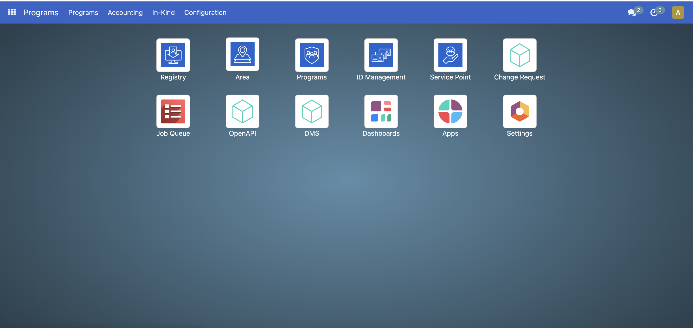
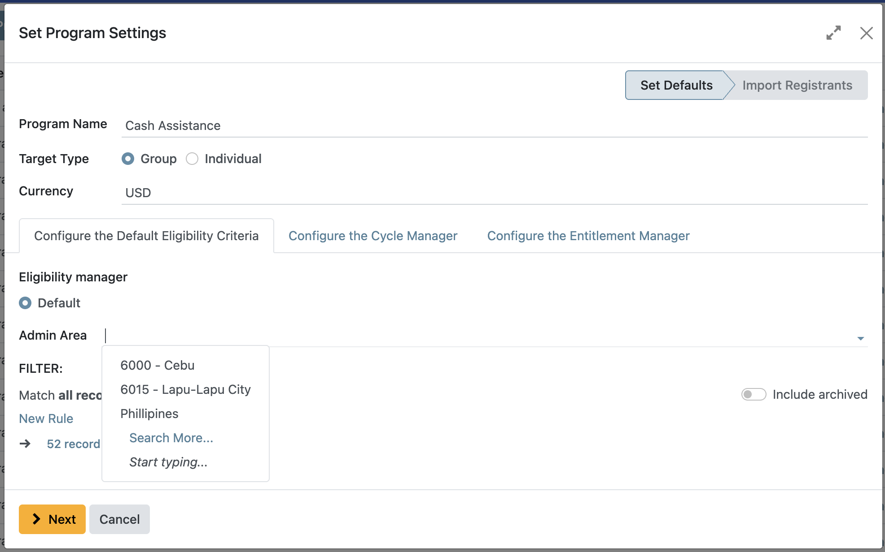
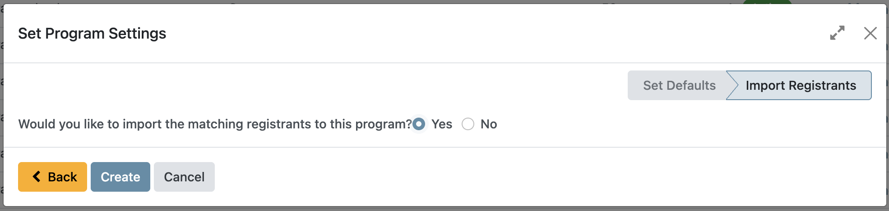

# Creating a Program

This tutorial offers a comprehensive, step-by-step guide for establishing a social protection program using the OpenSPP platform. It is designed to assist users in configuring programs according to specific objectives and operational requirements.

## Prerequisites

To create a social protection program using OpenSPP, you need to:

- Ensure your user account have the appropriate user permissions, such as **Global Program maanger** or **System Admin** roles. Learn more in this guide: {doc}`../administration/user_access`
- Have existing groups or individuals in your registry either through manual creation or through import. Learn more about this in the documentation {doc}`../registry_management/import_export_registrant_data` and {doc}`../registry_management/register_individual`.

## Objective

By the end of this tutorial, you will have successfully set up and created social protection programs within the OpenSPP platform.

## Process 

Summary: To create a program, begin by configuring the eligibility criteria to filter registrants who will be enrolled. Next, set up the Cycle Manager to define the duration and assign the user responsible for managing the program cycles. Proceed to configure the Entitlement Manager to specify the types of entitlements managed by the program. Finally, import registrants who meet the eligibility criteria based on your selected configuration.

### Creating a Social Protection Program

The creation process consists of logging in to OpenSPP with a user account that has the system admin or global program manager role. Also make sure to verify that the **Registry** contains existing groups or individuals. After verifying, navigate to the programs by clicking on the menu icon in the top-left corner, click Programs, and then click on **Create Program**.

### Set Program Settings

To set up the program, first enter the **Program Name** which will serve as the identifier of the program. Choose the **Target Type** for the program, which can be either **Group** or **Individual**. Next, specify the **Currency** type by selecting your preferred option from the **Currency** section. Once done, navigate to the other configuration tabs to set up the **Default Eligibility Criteria**, the **Cycle Manager**, and the **Entitlement Manager**.

### Configure the Default Eligibility Criteria

The **Default Eligibility Criteria** feature determines which registrants are eligible to participate in a program. If no eligibility criteria are configured, then all registrants in the database are considered eligible by default. There are other modules for eligiblity manager, SQL Query,Tag based or Manual Eligibility, these modules are available to be installed to fit the user's needs. 

This documentation will describe the **Default** option.

First, you need to specify the **Admin Area** for the targeted groups or individuals. No defined admin area means all records from any area will qualify for the eligibility criteria.

Then, under **Filter** you can further compose a query to narrow down your criteria. No defined **Filter** means no criteria

The sample query below denotes `Number of individuals` greater or equal to 1 AND `Date of Birth` greater than december 15 2023

only registrants that match this criteria would be able to possibly enrol to the program.
<!-- 
Then, under Filter, click on **New Rule**. Proceed by selecting the appropriate data from the options provided, such as family status (e.g., families with children), gender, or income bracket. Following this, establish a specific condition for the data selection—options include criteria like greater than, equal to, or contains. Subsequently, input the necessary criteria to define the filter parameters. by selecting either **All** or **Any** to determine if data points must satisfy all specified conditions or any one of them, respectively. The filters applied depend on the target type, as some filters apply to groups while others apply to individuals only. -->

>Selecting `all` means all query statements must match the registrant to qualify.
>Selecting `any` means any query statements must match the registrant to qualify.

### Configure the Cycle Manager

To set up the cycle, you need to define the following fields:

- **Auto-approve Entitlements**. Choosing this feature enables the auto-approval of entitlements, meaning that entitlements will be automatically approved upon approving the cycle in which the entitlements were generated from.
- **Approver Group**. Selects which user account role should approve the cycle.
- **One-time Distribution**. Choosing this feature creates the cycle as a one-time distribution, which can be used for one-time grants or support. The use of this feature disables the recurrence field.
- **Recurrence**. Defines how long each cycle lasts. For example, selecting `3` and then `Months` means each cycle will span three months.
- **Day of Month**. When Selecting **Months** as recurrence, this field defines when each cycle should start, either by a specific date in a month(e.g 3rd of each month) or by a specific day of the week(every first monday etc..)

- **Day of the week**. When selecting weekly recurrence, it is possible to select which day(s) the cycle should start from.
>**Example:**  
>Suppose you set the recurrence to "Weekly" and select both "Sunday" and "Tuesday" as start days. This means each program cycle will last one week, and a new cycle will begin on the nearest upcoming Sunday or Tuesday, depending on the current date. For instance, if today is Friday and you generate a cycle, the next cycle will start on Sunday; if today is Monday and you generate a cycle, the next cycle will start on Tuesday.

### Configure the Entitlement Manager

The **Entitlement Manager** defines what should be distributed to the beneficiaries covered by the program. The **Entitlement Manager** supports multiple forms of entitlement, which are explained in separate documentation:

- **Cash:** designated for cash disbursements. The system automatically generates cash benefits for individuals identified as qualified beneficiaries. Read more in the documentation {doc}`configure_entitlements`.
- **In-kind:** designated for the distribution of goods, such as food and various materials.
- **Basket Entitlements:** similar to in-kind entitlements, this is for the distribution of a set of products or materials. Unlike individual distributions, these are assembled into one basket rather than listed as separate items. Read more in the documentation Configure basket entitlements.

### Import Registrants

### Import Registrants

The **Import Registrants** feature enables you to add eligible registrant records to the program during its creation. If you select **Yes** at the final step and click **Create**, the import process will begin automatically. If you choose **No**, you can import registrants later as needed. For detailed instructions, refer to {doc}`enrol_beneficiaries`.

The program is now created and can be edited anytime.

