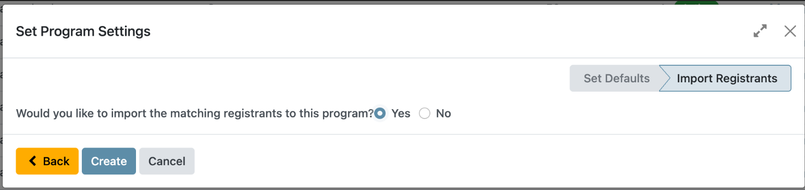
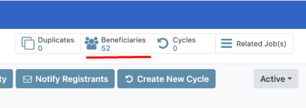
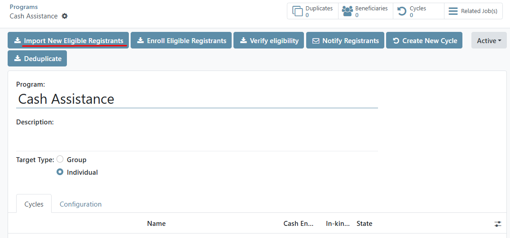
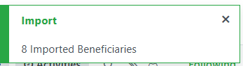
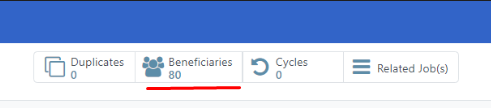
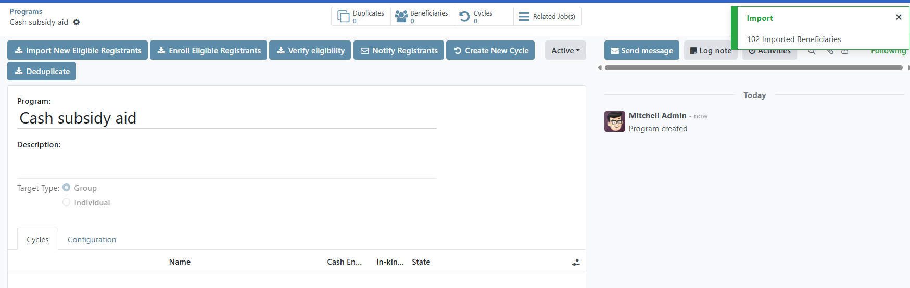
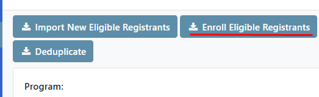
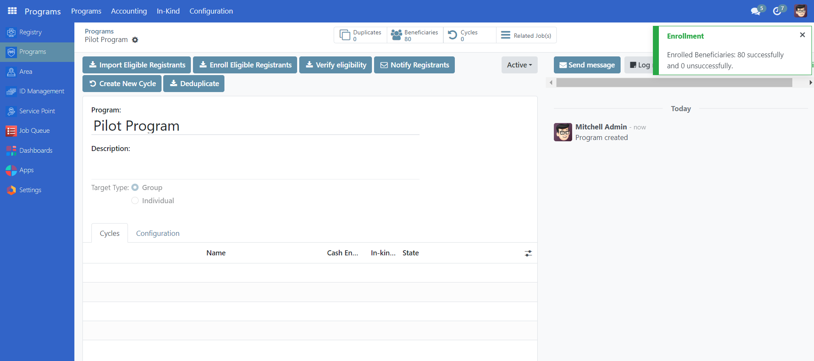
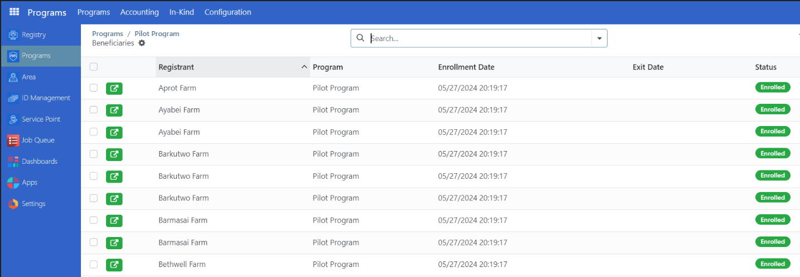

---
myst:
  html_meta:
    "title": "Enrol beneficiaries"
    "description": "Learn how to enrol beneficiaries in OpenSPP programs, including both automatic and manual enrollment processes for individuals and groups."
    "keywords": "OpenSPP, enroll beneficiaries, import registrants, program enrollment, beneficiary management"
---

# Enrol beneficiaries

In this tutorial, you will learn the process of enrolling beneficiaries in OpenSPP.
Accurate beneficiary enrolment ensures that the right individuals or groups receive the intended benefits.

## Prerequisites

To enrol beneficiaries in OpenSPP, you need to:

- Have an existing program. Learn more about how to configure a program in the documentation {doc}`create_program`.
- Ensure your user account have the appropriate user permissions, such as **Global Program manager** or **System Admin** roles. Learn more in this guide: {doc}`../administration/user_access`

## Objective

This tutorial instructs users on how to enrol beneficiaries into a program in OpenSPP. By following these procedures, users will be able to import and enrol both individual and group beneficiaries, ensuring they are registered for the necessary support and benefits. Upon completion, users will have successfully added eligible beneficiaries to their respective social protection programs.

## Process

Enrolment is done for groups or individuals.
Both enrolments can be done either as part of the program setup or after configuring the program. 

### Beneficiary Import and Enrolment

The process progresses through two sequential stages, regardless of whether the program supports individual or group beneficiaries:

- Import beneficiaries. This step involves the integration of beneficiaries who are eligible to receive support from a social protection program.
Which beneficiaries to import into the program are defined by the filter in the eligibility criteria.
- Enrol beneficiaries. After the beneficiaries have been imported into the system, the next step is to enrol them in the program.
Enrolment involves verifying the eligibility of each beneficiary based on the program's criteria, such as income level, age, or other factors.
Once a beneficiary is enrolled in the program, they are entitled to receive the benefits or services provided by the program

Depending on the choices made in the program setup, there are two different ways to perform these steps, both of them are described below.

### Import and Enrolment during Program Creation

If **Yes** is selected during the final step of program setup, both the beneficiary **import** and **enrolment** processes are automatically executed as part of program creation.

Once completed, the number of beneficiaries imported and enrolled is displayed on the toolbar.

Click the **Beneficiaries** button to view the imported and enrolled beneficiaries in the table view.

This confirms that the beneficiaries are imported and enrolled.

### Import and Enrolment on already Existing Programs

If the option **No** has been selected as the final step of the program setup, both Import and Enrol steps needs to be done as a separate action prior to proceeding.

This action consists of two steps, first the import of registrants into the program, and then the enrolment of the previously imported registrants into the program.

#### Import Registrants
To import registrants into a program manually, Select an existing program you wish to import registrants into, then click on **Import New Eligible Registrants** button.

A success notification should prompt

>**Note:** The number displayed on the **Beneficiaries** button below reflects the total count of beneficiaries who have been successfully enrolled in the program. This does not represent the number of registrants imported.

When potentially large volume of beneficiaries are being imported, it is essential to ensure that the import process has fully completed prior to initiating enrolment.
This precaution helps prevent any issues during the enrolment phase.

In the case of small number of beneficiaries, a green pop-up will appear on the right side of the screen, indicating that the import process is complete and beneficiaries have already imported.
The time it takes to import the beneficiaries will depend on the number of beneficiaries eligible for the program, and it is vital to allow the import to complete before proceeding.

In the case of greater number of beneficiaries, a yellow notification will display informing that the page needs to be refreshed to see the status of the import.

#### Enrol Registrants

To manually enrol registrants into a program, first confirm that the import process has been completed.
You may confirm this by clicking the **Beneficiaries** button, verify that registrants are listed and is under **Draft**, then go back to the program page to proceed and click **Enrol Eligible Registrants**.

If there are a large number of records to process, a yellow notification will appear on the right side of the screen to indicate that enrolment is in progress.
After enrolment for all participants is complete, refresh the page.
If the warning message disappears or a success notification is displayed, this confirms that the enrolment process has finished.

The number of beneficiaries imported and enrolled is displayed on the **Beneficiaries** icon.

After completing the enrolment process, it is recommended to verify that all beneficiaries have been successfully enrolled by checking their status.
To do this, click the **Beneficiaries** button to access the table view, where you can review the list of imported and enrolled beneficiaries.
This allows you to confirm that the correct individuals or groups are registered and eligible for program benefits.

