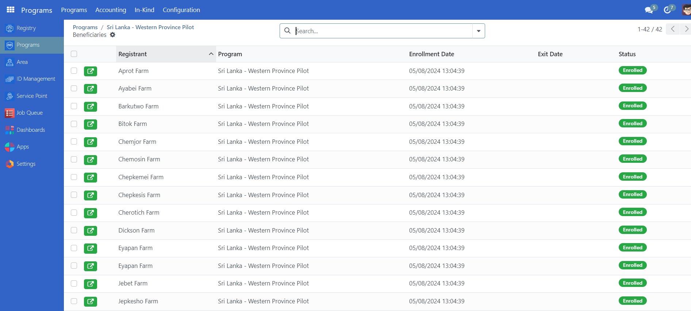
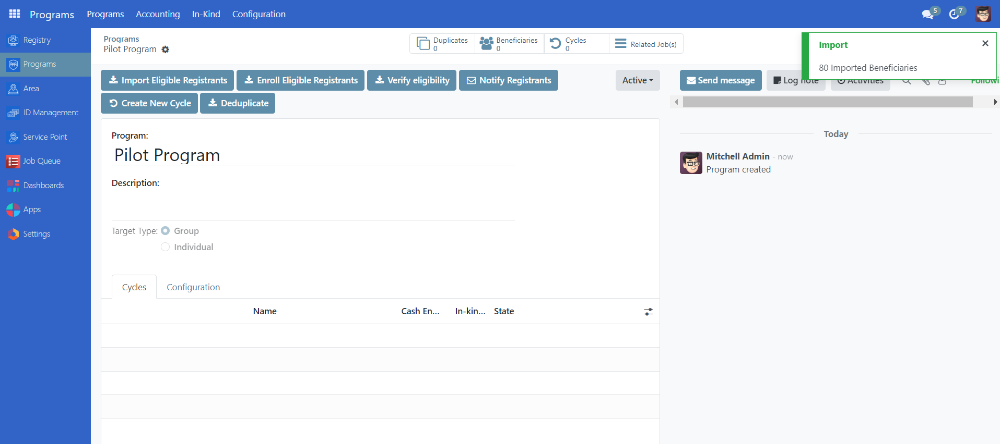
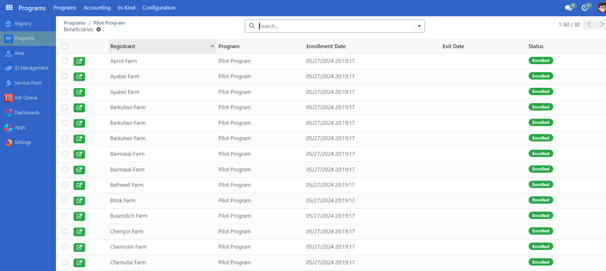

# Enroll beneficiaries

## Introduction

This guide provides step-by-step instructions for enrollment processes for individual and group beneficiaries.

## Prerequisites

In order to enroll beneficiaries in OpenSPP, you need an existing program. Learn more about how to configure a program in the documentation Create a social protection program.

## Objective

This how-to instructs users on how to enroll registrants in OpenSPP into a program. Upon completion, you will have successfully added eligible beneficiaries to a social protection program and can proceed by creating cycles and performing distributions.

## Step-by-step

Once the program has been configured according to How to-Create a social protection program, the next step is to enroll the beneficiaries who will benefit from the social protection program. Depending on the target type selected in the program creation, you can enroll either individuals or groups. The following two steps need to be taken as a part of the enrolment step:

**Importing Beneficiaries:** Importing beneficiaries into a program means that any beneficiaries in the system that match the eligibility criteria will be included in the program as potential beneficiaries.

**Enrolling Beneficiaries:** Enrolling beneficiaries into the program means beneficiaries are successfully imported and authorized to access the program's benefits or services.

Depending on the choices made in the program setup, there are two different ways to perform these steps, both of them are described below.

### Import and enrollment as part of program setup

If the checkbox **Yes** is selected in the final step of the program setup, the beneficiaries will already have been imported and enrolled as part of the program configuration, meaning that no additional step needs to be taken and it is possible to proceed to create a cycle. Learn more about how to create a cycle in the documentation Create a program cycle & prepare entitlements.

To verify that the beneficiaries have been enrolled, you can follow the steps below:

1. Navigate to the program. The **Beneficiaries** icon will display the number of beneficiaries imported and enrolled.

2. It is possible to click the **Beneficiaries** icon to view the imported and enrolled beneficiaries in the table view. The status column should say **Enrolled**.

### Import and enrolment after program creation

If the checkbox **No** has been selected in the final step of the program creation, the beneficiaries will not be imported and enrolled as part of the program creation, and this will need to be done as an additional step as described below:

1. Click **Import Eligible Registrants** in order to initiate the import. Before proceeding with the next step of enrolling the beneficiaries, it is important to allow the system to complete the import. The time it takes to import the beneficiaries will depend on the number of beneficiaries eligible for the program. Depending on the number of beneficiaries, the display for completion also varies. In cases of less than 1000 beneficiaries, a green popup will display when the import is completed.

In the case of more than 1000 beneficiaries, a yellow notification will display informing that the page needs to be refreshed to see the status of the import.

The import is completed when the yellow notification is no longer displayed when refreshing the page.

2. Once the import has been completed, click on the icon **Enroll Eligible Registrants**. This action will trigger a beige pop-up notification, indicating that the enrollment process has commenced. Following the completion of enrollment for all participants, refresh the page and if the warning message disappears, then it means that the import is already complete. You should also check the beneficiary page to see if the registrants are there.

3. The **Beneficiaries** icon will display the number of beneficiaries imported and enrolled. It is also possible to click the **Beneficiaries** icon to view the list of imported and enrolled beneficiaries in table format.

---

## Merged Content

### Content from docs/tutorial/user_guides/enroll_beneficiaries.md

# Enroll beneficiaries

## Introduction

In this tutorial, you will learn the process of enrolling beneficiaries in OpenSPP. Accurate beneficiary enrollment ensures that the right individuals or groups receive the intended benefits.

## Prerequisites

To enroll beneficiaries in OpenSPP, you need an existing program. Learn more about how to configure a program in the documentation Create a social protection program.

## Objective

This tutorial instructs users on how to enroll beneficiaries into a program in OpenSPP. By following these procedures, users will be able to import and enroll both individual and group beneficiaries, ensuring they are registered for the necessary support and benefits. Upon completion, users will have successfully added eligible beneficiaries to their respective social protection programs.

## Process

Efficient enrollment is important for the success of social protection programs in OpenSPP. Depending on the target type, the enrollment is done for groups or individuals. Both enrollments can be done either as part of the program setup or after configuring the program. The process of creating a social protection program is described in the documentation Create a social protection program.

### Beneficiary Import and Enrollment

Upon finalizing the creation of the program, the process progresses through two sequential stages, regardless of whether the program supports individual or group beneficiaries:

- Import beneficiaries. This step involves the integration of beneficiaries who are eligible to receive support from a social protection program. Which beneficiaries to import into the program are defined by the filter in the eligibility criteria.
- Enroll beneficiaries. After the beneficiaries have been imported into the system, the next step is to enroll them in the program. Enrollment involves verifying the eligibility of each beneficiary based on the program's criteria, such as income level, age, or other factors. Once a beneficiary is enrolled in the program, they are entitled to receive the benefits or services provided by the program

Depending on the choices made in the program setup, there are two different ways to perform these steps, both of them are described below.

### Import and enrollment as part of program setup

If the option **Yes** has been selected at the final step of the program setup, the import and enrollment will be carried out as part of the program creation.

Once completed, the number of beneficiaries imported and enrolled is displayed on the toolbar.

Click the **Beneficiaries** icon to view the imported and enrolled beneficiaries in the table view.

This confirms that the beneficiaries are imported and enrolled.

### Import and enrolment after program creation

If the option **No** has been selected as the final step of the program setup, this needs to be done as a separate action prior to proceeding.

This action consists of two steps, first the import of beneficiaries into the program, and then the enrollment of the previously imported beneficiaries into the program.

Take note that, given the significant number of beneficiaries for importation, it's important to make sure that the import process has been completed before initiating any enrollments to avoid complications.

Select **Import Eligible Registrants**. In the case of less than 1000 beneficiaries, a green pop-up will appear on the right side of the screen, indicating that the import process is complete and beneficiaries have already imported. The time it takes to import the beneficiaries will depend on the number of beneficiaries eligible for the program, and it is vital to allow the import to complete before proceeding.

In the case of more than 1000 beneficiaries, a yellow notification will display informing that the page needs to be refreshed to see the status of the import.

Once the import has been confirmed to be completed, either by seeing the green notification popup or, in the case of more than 1000 beneficiaries, by refreshing the page until the yellow notification popup no longer appears, it is time to enroll the beneficiaries.

Click the **Enroll Eligible Registrants** icon. A yellow pop-up will appear on the right side of the screen, indicating the process of enrollment. Following the completion of enrollment for all participants, refresh the page and if the warning message disappears, this indicates that the import is complete. You should also check the beneficiary page to verify that the registrants are there.

The number of beneficiaries imported and enrolled is displayed on the **Beneficiaries** icon.

Click the **Beneficiaries** icon to view the imported and enrolled beneficiaries in the table view.

