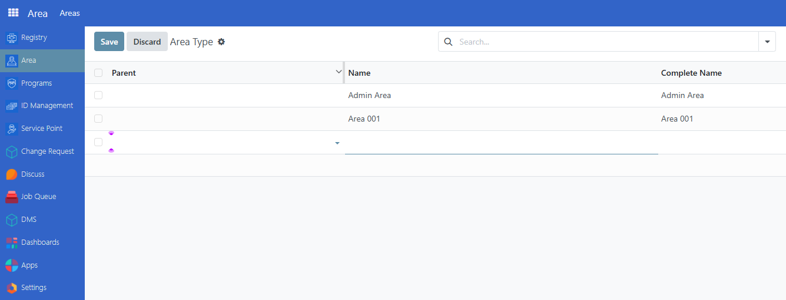

# Geotargeting

Use geotargeting to increase accuracy and {term}`effectiveness` in {term}`social protection` program enrollment. Geotargeting identifies potential {term}`beneficiaries`' locations, letting program administrators accurately target {term}`outreach` efforts, deliver {term}`benefits` to those in need, and reduce {term}`fraud` and leakage risks.

OpenSPP's built-in geotargeting capabilities allow program administrators to locate potential beneficiaries based on location and streamline the enrollment process, ensuring eligible individuals get necessary benefits.

## Prerequisite

To create an Area for Geotargeting in OpenSPP, you need to:
- Have a **System Admin** or **Registrar** role, Learn more in this guide: {doc}`../administration/user_access`. 
- Have `OpenSPP area management` and `OpenSPP area management base` modules installed and activated. Please note that both these modules are auto-installed and activated when {doc}`spp_base </reference/modules/spp_base>` is already activated. Learn more on installing additional modules in the {doc}`../../getting_started/module_installation` document.

## Objective

Enable users to configure and apply geotargeting features in OpenSPP for social protection program enrollment. Users will learn to set up data fields and parameters, perform geotargeting analysis, and generate reports to support accurate beneficiary targeting and program effectiveness.

## Process
Define an area by assigning it a name and specifying its hierarchical level—either as a parent-level or a sub-level. Once a parent area is created, you can add sub-areas within it, and continue nesting as needed. This flexible structure accommodates the unique area segmentation of each country.

### Define Geographic tree

#### Create Parent Area
To make use of geotargeting in OpenSPP, you must first define a geographic area tree. Oftentimes, you will have different levels such as:

- country
- state
- province
- district
- city
- or any other geographic area that you want to target.

OpenSPP allows you to define any number of levels and to define the hierarchy between them. For example, you can define a country, then define states within that country, and then define districts within each state. You can also define a hierarchy between districts and cities, or between cities and villages.

Login as administrator or a user with permitted access rights and navigate to Area

In the Area page, click on New, 
- Define the name of the Area
- Leave parent field empty as this will be the parent area
- Define an alternate name
- Under `Kind` dropdown field, select `Admin area`
- Define Area (sq/km)

Click on the Save icon to complete the changes.

#### Create Sub Area
To create a sub level of a parent area, Nnavigate to Area-->New.

- Define the name of the Area
- In the Parent dropdown field. select a Parent area.
- Define an alternate name
- Under `Kind` dropdown field, select `Admin area`
- Define Area (sq/km)

Click on the Save icon to complete the changes.

### Import

Import an area through an xlsx file. Learn more in this guide: {doc}`../administration/import_areas`

### Custom Area type

By default area are imported as `Admin Area`. You can change the area type of an area by editing it and selecting the area type you want.

You can define your own during import, new area type are automatically created.

To import an area and specify the area type, you need to add a column in the excel file with the name `admin1Kind` (`1` need to be replaced by the admin level) and the value of the area type you want to use.

You can also define your own area type from the interface. To do so, you need to define the area type in the Area-->Areas-->Area Type. Click on **New** then click on the Name input field to define. The Completed name will auto generate once it has been saved. 

You can select a parent area type if you want to define a hierarchy between area types and set a name.

Click **Save** to complete the changes.

