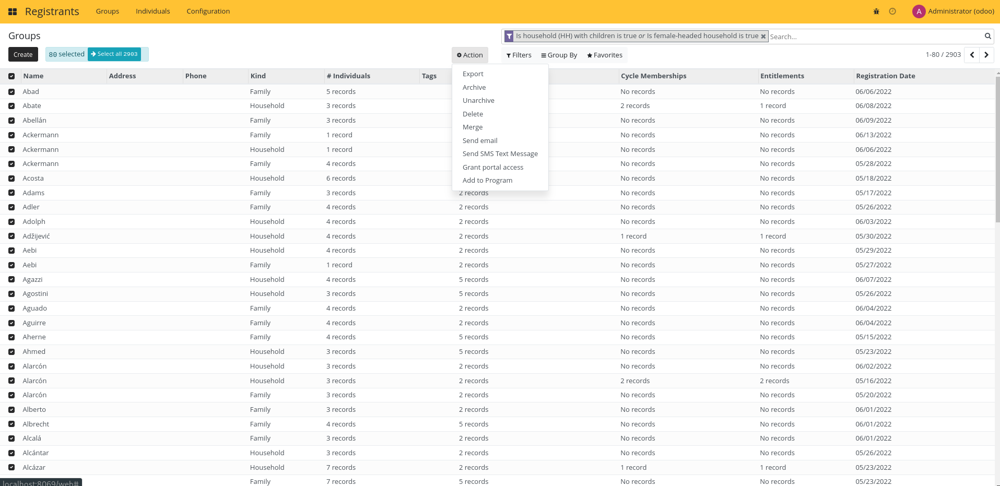

# Exporting Registrants

## Export to Excel or CSV

Both Groups and Individuals can be exported.

These are the step to follow:

1. Filter the registrants you want to export using the list filtering features.

2. Select the registrants you want to export.

3. Click on export from the action menu.

4. Configure your export. You can create your own export template to make the process faster.

5. Click on Export, your Excel (XLSX) or CSV export will be downloaded.

To learn more about export capabilities, read the Odoo documentation.
