# Document Management System
 
In this tutorial, you will learn how to use the Document Management System feature in OpenSPP.

## Prerequisites  
To utilize the DMS feature, you need to:  
- Have existing individual records in your registry, either by creating records manually or importing records into OpenSPP. Learn more about this in the guide  {doc}`register_individual` or {doc}`import_export_registrant_data`
- By default, A user account with **System Admin** has sufficient permission to access the DMS. Learn more in the guide {doc}`../administration/user_access`
- Ensure that the DMS module `spp_dms` is properly installed and activated. Note that the Change_request (`spp_change_request`) module automatically installs the DMS module. To learn installing optional modules, refer to the **Installing Additional Modules** section in the document: {doc}`../../getting_started/module_installation`.
- A change request must have an attached document.

## Objective  
By the end of this tutorial, you will be able to access and review documents uploaded to OpenSPP, manage these documents effectively, and configure the document types allowed for upload.

## Process  
Make sure you’re logged in as a system administrator or a user with the appropriate access rights. To customize the document types displayed, navigate to the DMS module and select `Configuration → Categories`. Once configured, you can browse the auto-generated directories created when a change request is drafted. These directories follow the format `CR-[year]-[sequence number]`, such as `CR-2025-000001`, and allow you to preview or download documents by directory. To view all uploaded documents across directories, go to `DMS → Files`. This alternative view organizes change requests by their creation date. For improved document management, you can create custom directories by selecting `Directories → New`. This lets you define folders where uploaded documents can be stored and organized.

### Configure document types  
To modify document types in DMS, navigate to `DMS → Configuration → Categories`.  
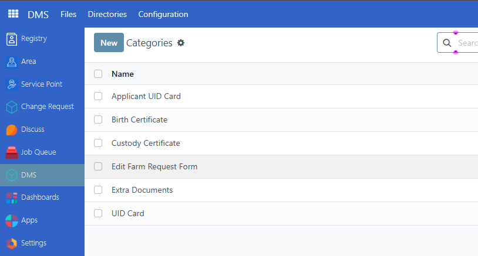

#### Create new document type  
Click **New** to create a new document type. Enter the name of the ID type, then click **Save** to apply the changes.  

#### Edit document type  
To edit a document type, click on the name of the document type to edit it directly. Then click **Save** to complete the changes.  
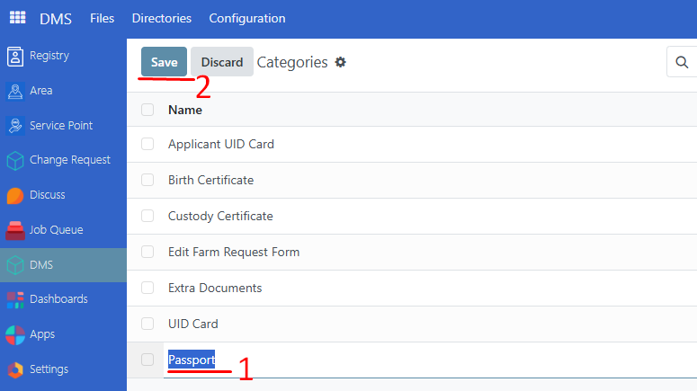

#### Delete document type  
To delete a document type, enable the checkbox beside the document types you wish to delete, then click on **Actions → Delete**.  
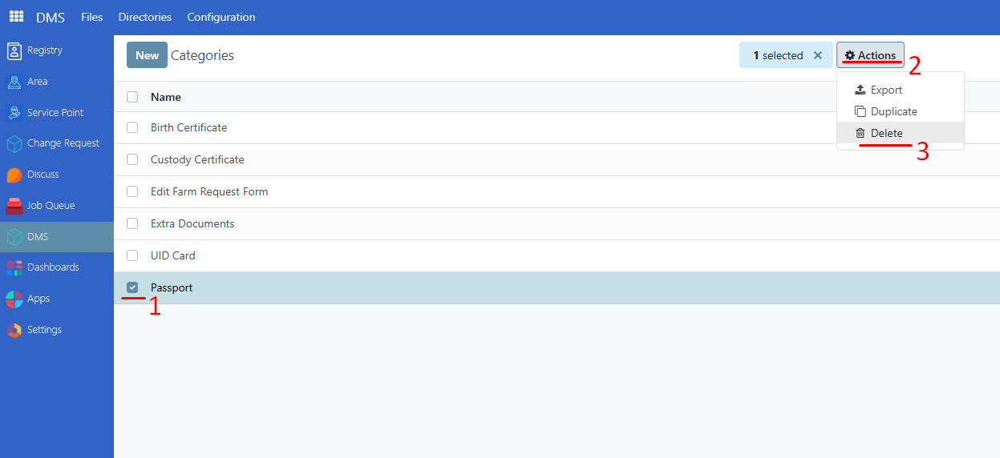

> **Note:** Attempting to delete a document type that is already being used by a change request will display an error message.  
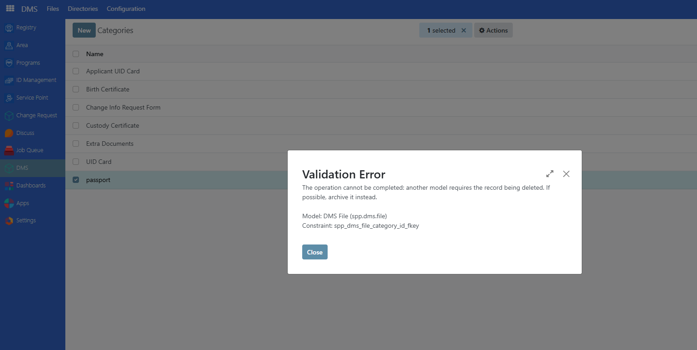

### Preview and download documents  
To preview attached documents, navigate to `DMS → Files`. All attached documents from change requests should be listed on this page.  
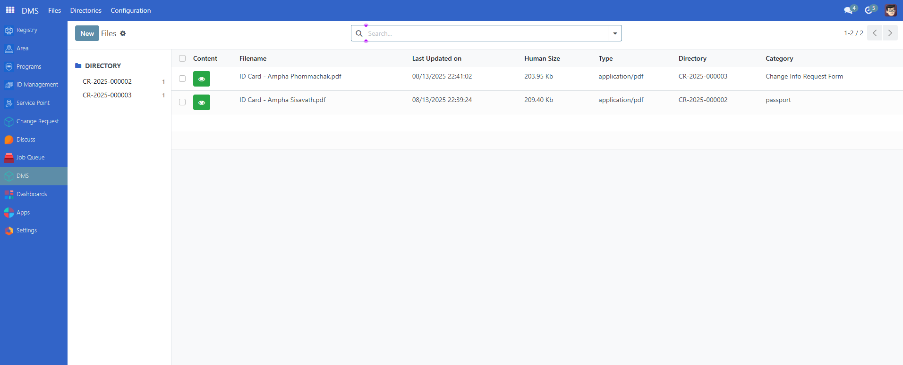

> **Note:** The number shown next to each change request or directory represents the total number of documents attached to that specific request or directory.  
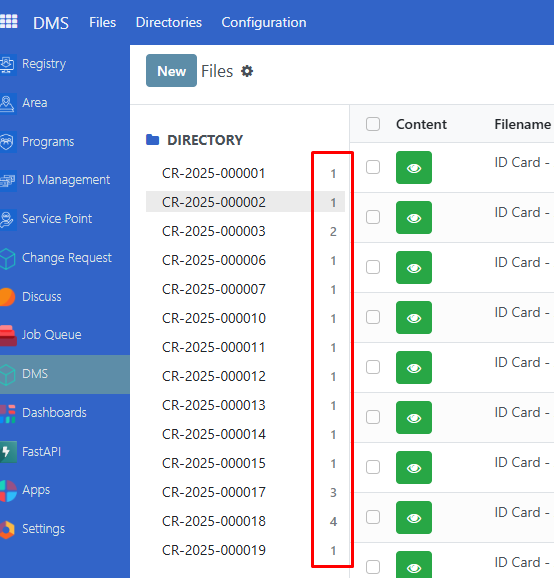

#### Preview document  
To preview a document, click on the eye button. A window should appear displaying a preview of the document.  
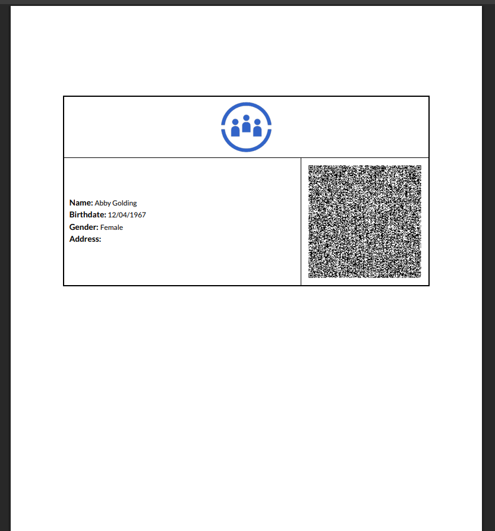

#### Download document
To download a document from a directory, click on a directory and it should display all documents associated with the directory.  
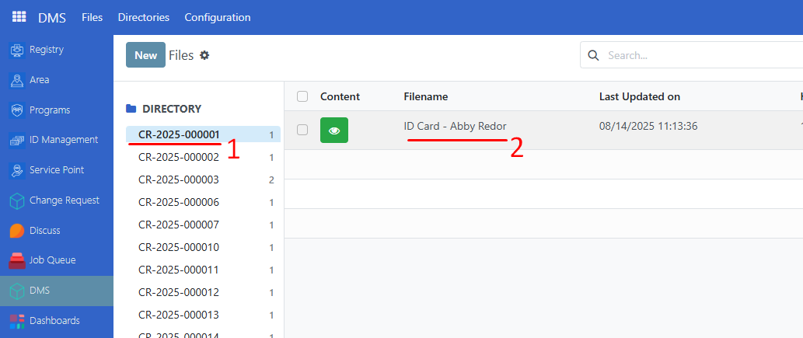

Click on the document you wish to download and click on the download icon.  
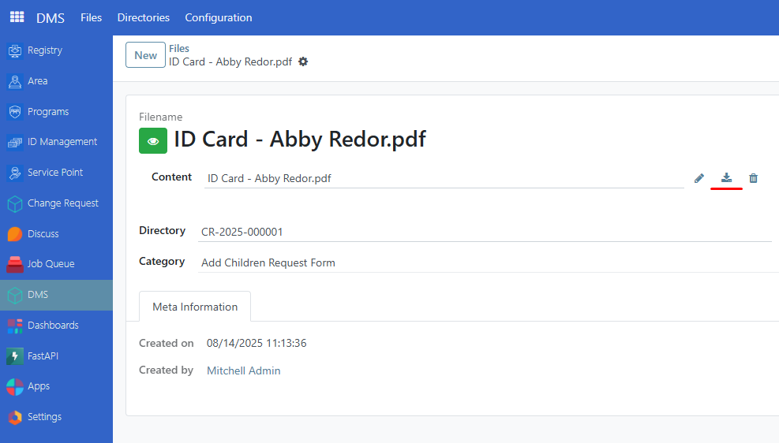

#### Edit document attachment  
It is also possible to edit a document attachment in a change request. Click on the directory or change request you wish to update.  
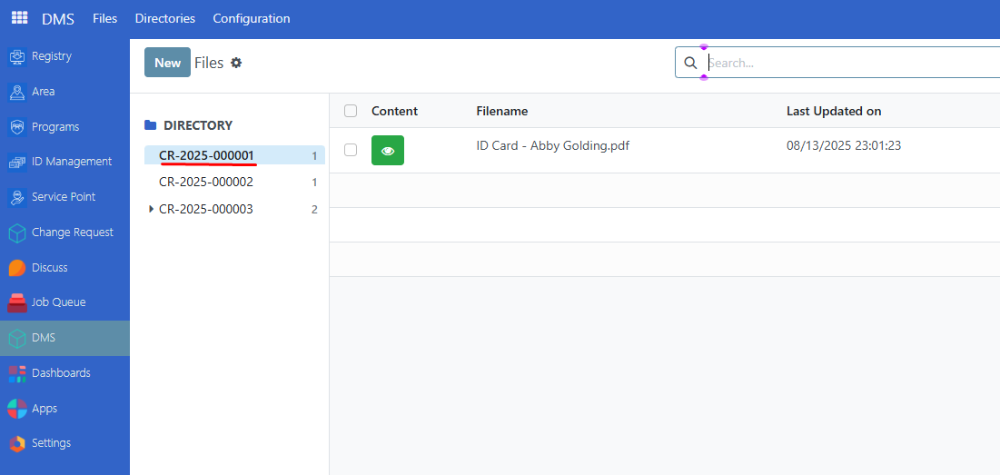

Select a file from that change request that you wish to modify, then click on the pencil icon to re-upload another document.  
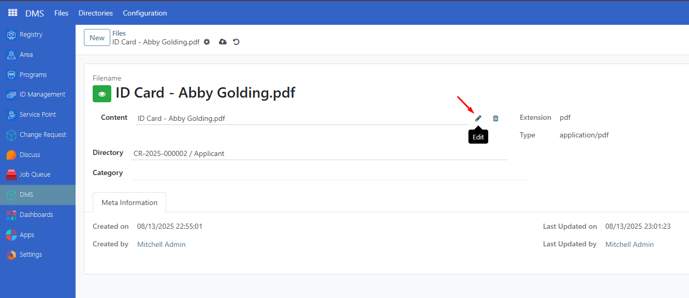

### Navigating Directories  
An alternative view is available with the **Directories** feature. This feature displays a list of directories along with their subdirectories.

#### Create Directory  
It is also possible to create your own directory and name it accordingly. This can help in organizing important documents. Navigate to `Directories → New`. Define the name of the directory and check the box **Is Root Directory**.  
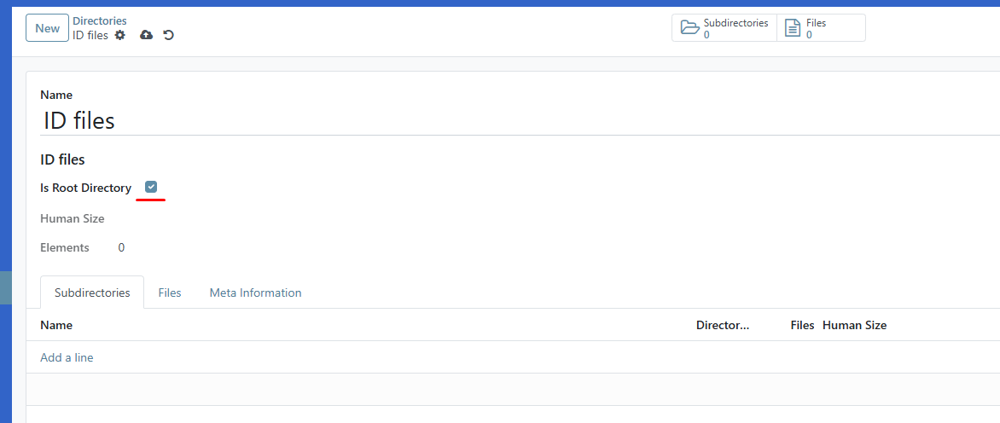

Click on the **Subdirectory** tab, then click on **Add a line**, then rename the subdirectory.  
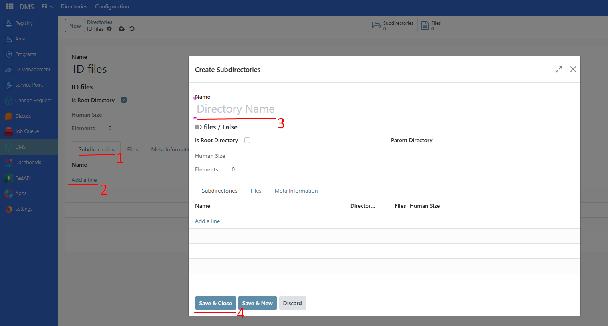

Click on **Parent Directory** to display the directory list. Click and select to make this a subdirectory of the selected parent directory.  
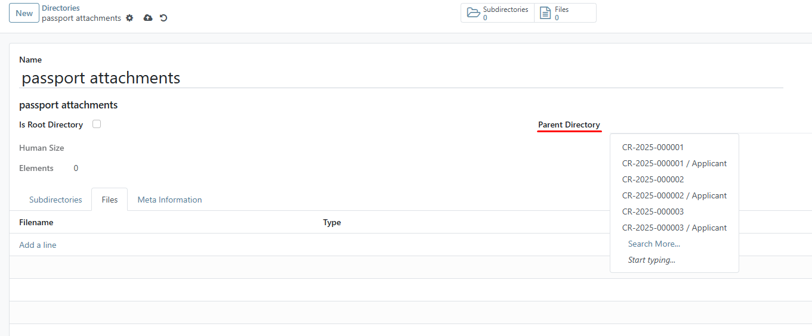

> **Note:** It is important to create a subdirectory for each root directory, as file uploads will be done within their subdirectory.

#### Uploading files in subdirectory  
To upload a file, navigate to `DMS → Directories`. Click on a parent directory, then click on its subdirectory.  
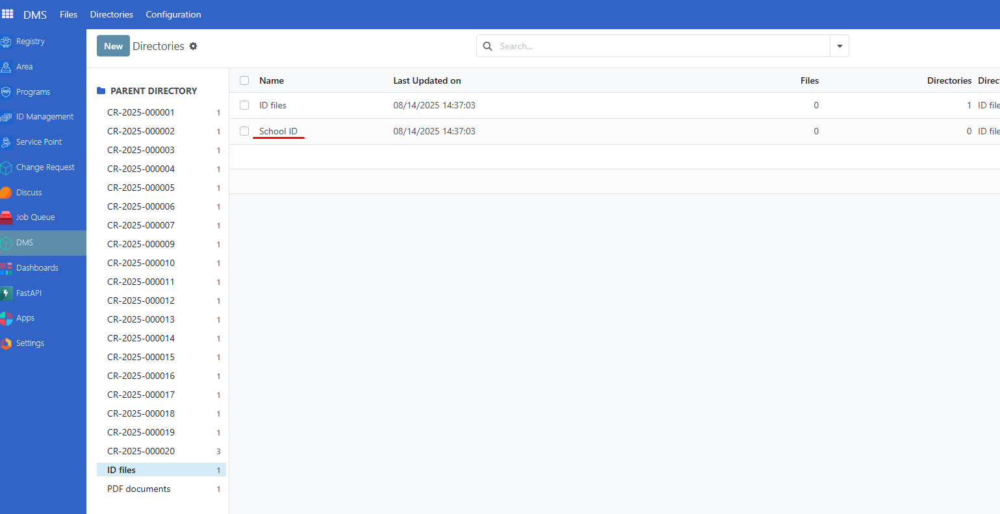

On the **Files** tab, click on **Add a line**, click on the input field to select the ID type, then click on **Upload your file** to select the document. Click on **Save** to complete the upload.  
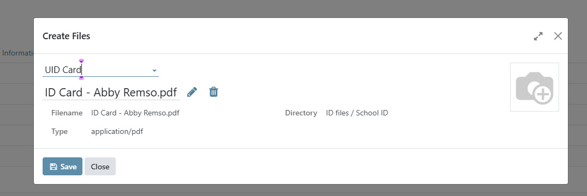

#### View all documents per directory  
Navigate to `DMS → Directories` to view all directories, subdirectories, and attachment counts on one page. When in the Directories page, the number beside the change request or directory indicates the count of subdirectories it has.  

