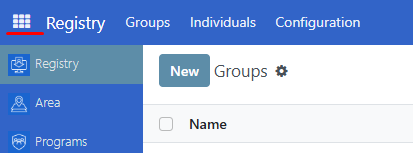
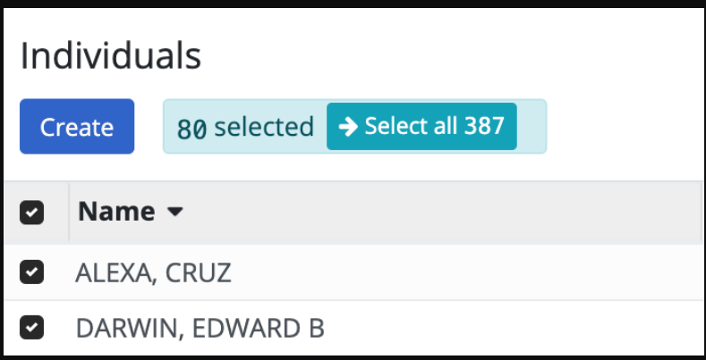
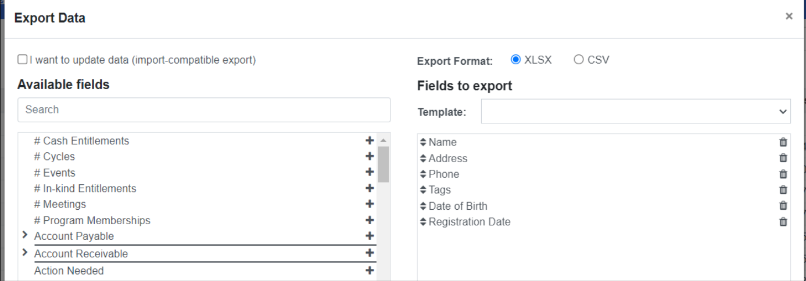
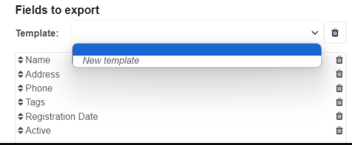

# Export Registrant Data

## Introduction

This guide offers a comprehensive, step-by-step overview of the process for exporting registrant data from OpenSPP. It details the procedures, configurable options, and considerations available to system administrators.

## Prerequisites

To be able to export registrant data from OpenSPP, the following is required: 

- Ensure you have a user account with admin access to the OpenSPP platform. Learn more in this guide: {doc}`../administration/user_access`.
- Prepare registrant data in CSV or Excel format.  
- Determine the list of fields relevant to the data you wish to export.

## Objective

By the end of this tutorial, you should understand the purpose and process of exporting registrant data from OpenSPP. You'll learn how to extract and save registrant data in a specified format for various purposes, such as data analysis, record keeping, or migration to another platform. 

## Process

Select existing individual records to export and define export parameters, save as either **CSV** or **XLSX**.

### Specify export parameters

Specifying export parameters is done in the Registry section of OpenSPP, which you can access by clicking on the menu icon in the top-left corner and selecting **Registry**.

Depending on your needs, you can export data for **Groups** or **Individuals**. The export procedure is identical in both cases, but the exportable fields differ.

Navigate to either **Groups** or **Individuals** and select which records to export by clicking the checkboxes beside each record. To select all displayed records, click the checkbox beside **Name**.If you want to export more records than are displayed on the page, select them by clicking **Select all**.

After selecting the records, click the **Action** button and select the **Export** action from the list of actions.

Two formatting options are available when exporting data: **CSV** and **XLSX**. Which one to select depends on how you will use the exported file.

The left column displays all data fields available for export, and the right column (**Fields to export**) shows the fields included in the file export. Some fields are pre-selected by default, such as **Name**, **Address**, **Phone**, etc. Examples of fields include date of birth, registration date, program types, or demographic information. 

Select the fields you would like to export by clicking the **+** icon. Fields indicated with an arrow **>** also contain subfields to narrow down the data you want to export. Clicking the arrow will display the subfields available for selection. You can remove fields in the **Fields to export** column by clicking the trash icon. Depending on your requirements, you can add any fields available for export in the left column. 

Once you are satisfied with the selected fields in the right column, click the **Export** button at the bottom of the export window to start the export.

### Export to add or update existing data

 If you aim to update existing or add new data in OpenSPP, tick the checkbox **I want to update data (import-compatible export)**. By ticking this checkbox, a column **Id** is automatically included in the exported file, containing the external identifier value of each **registrant** or data. This reference value serves to identify the current registrant, allowing updates to its other fields. By ticking this checkbox, some fields will be automatically hidden and made unavailable for export; this limits you to the fields you can update in OpenSPP.

### Creating export templates

Create a template for the set of fields that you have selected to make it use to perform the same export later. 
By clicking on the dropdown arrow, click on **New template**, set a name for your template, make sure you have already selected your desired fields for this template, and click the save icon.

After saving, you can select your template by clicking on the dropdown arrow again and clicking the name of your template.
The specific steps and interface may vary depending on the OpenSPP version. Always seek assistance from the support team if you need further guidance.
