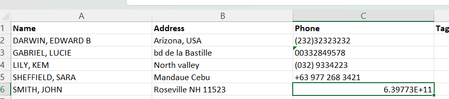

# Import Registrant Data

## Introduction

In this tutorial, you will learn the process of importing registrant data in CSV or Excel format using the OpenSPP platform. The tutorial covers the import of new data, as well as the update of existing data.

## Prerequisites

To import registrant data into the OpenSPP, you need to:

- Ensure you have a user account with admin access to the OpenSPP platform. Learn more in this tutorial:[Tutorial: Administrating role-based access.docx](https://docs.google.com/document/d/1hdqj9wkgiC1XiGunpkkeIELXFyIQTu3L/edit#heading=h.gjdgxs)  
- Prepare registrant data in CSV or Excel format.  
- Have access to spreadsheet software capable of editing and saving CSV or Excel files, such as Microsoft Excel.

## Objective

This tutorial aims to instruct users on how to efficiently manage registrant import within the OpenSPP system. It includes steps for importing substantial data volumes from CSV or Excel files, essential for incorporating new beneficiaries as programs grow.

## Process

The import process consists of logging in to OpenSPP with an admin user account, navigating to the registry, exporting registrants to obtain the correct file format, updating the values in the file, and importing it back into OpenSPP.

## Login with proper user access rights

To prevent data mishandling and improve data security, the permission to import and export data into OpenSPP is exclusive to user accounts with **System admin** role. Learn more about setting up and configuring admin role user accounts here: [Tutorial: Administrating role-based access.docx](https://docs.google.com/document/d/1hdqj9wkgiC1XiGunpkkeIELXFyIQTu3L/edit#heading=h.gjdgxs). To verify that your user account has the right permissions, navigate to the four-square icon on the top-left corner and click **Settings** from the list, click **Users & Companies** from the header; then click **Users**. This should display all user accounts in OpenSPP.

Click on the row of the user account and make sure that the **System Admin** role is set under the **Roles** tab.

  

This indicates you have the correct access rights to perform **import** and **export.**

## Export records to obtain necessary headers

Exporting records is associated with import, as it guides you on which **fields** are available to use when you want to add or update information.

If the import aims to add a new individual or group (as opposed to updating already existing data), you should export headers that are relevant to your import. You only need to export one record from groups or individuals to obtain the correct headers to use. See below for an example of a file with the relevant headers and a single record.  

If the import aims to update already existing individuals or groups, you need to obtain the reference ID for all the records that should be updated and export them. See below an example of a file with headers and multiple records which all include the column for ID.

To produce a file that includes the reference and all other fields mandatory for the update, tick the checkbox for  **I want to update data (import-compatible export)** in the export dialogue box. Selecting this checkbox also removes fields that cannot be imported back to OpenSPP from **Available fields**. An example of such a field is **Age**, which is a calculated field based on the **Date of Birth** of the individual and therefore cannot be updated through import.  

These unique identifiers are associated with each of the records. When you import the Excel file back into OpenSPP after you have updated your desired fields, make sure the values for the fields you updated only affect the ones you intend.

Learn more about export registrant data in [Tutorial: Export Registrant Data](https://docs.google.com/document/d/1zOLmAXZvHxJWvxz2JmzZL0buNz6wksIh/edit#heading=h.gjdgxs)

## Preparing file for import

- To add new individuals or groups, prepare the Excel file for import by converting cells to text for all fields that consist of numbers; for instance, **phone**, **date of birth, and** **registration date**. This is to avoid data errors when inputting number values into these fields. For example the **phone field**, where mobile numbers may start with the **\+** symbol or with leading zeroes can cause a mobile number to be formatted unexpectedly. It is therefore important to format cells to text before adding number values. Also note that when saving the file, only CSV and XLSX formatted files are allowed for import.   
- To update existing individuals or groups, open the exported Excel file and modify the cells you wish to update. Note that you should only format specific cells to text if your values break upon input. As in the image below, inputting a phone number with a leading \+ symbol is automatically formatted. In this case, you should format the specific cell to **Text** to resolve the issue. 

## Perform import

After the file is verified and ready, the import can be performed using an admin account. Navigate to the **Registry**, and depending on what type of data you are going to import, either click **Individuals** for individual records or **Groups** for group records. Click on the **Favorites** icon, then choose **Import records** from the dropdown menu. You will be redirected to the upload page. Click on the **Load File** button, and choose the file that you prepared. After uploading your file, you will be redirected to the page below. 

 

Click **Test**; this will validate the data in the import document. If the message **Everything seems valid** is displayed, it is possible to proceed with the import.

If there are any issues with the file, a message will instead be displayed giving directions on how to solve the issue. You may refer to the **Error handling** section of this document to learn more about common errors. 

When the file is considered valid, it is possible to click the **Import** button. This will redirect to the main table page, and you will receive a notification informing that the records have been successfully imported. 

## Error Handling

OpenSPP displays different types of error messages on the import page when encountering an error after clicking the **Test** button. This ensures no invalid value or file would compromise data in OpenSPP. Therefore, it is important to always **Test** the file first before importing. Here are common errors encountered during import.

### No matching records found

Some fields require values that are predefined in OpenSPP, such as the **category\_id** field. Setting a value in this column that does not match the values found in OpenSPP will return an error message. This error will be similar to the screenshot provided below.  

To resolve this type of error, only type in values that are defined in OpenSPP, in this case for **category\_id**, you can navigate to **Registry,** then click  **Configuration,** and after that, select **Registrant Tags**. You should see the list of the defined **Tags**. Only use these values from the list for **category\_id**.  

### To import, select a field

If OpenSPP could not recognize your header, it will display **To import, select a field** beside the unrecognized header, similar to the screenshot below.  

To resolve this error,  if you are familiar with what field you want to associate with your header, you can click **To import, select a field,** and then select from the list of fields you wish to associate your field values with, otherwise, you can remove the header from your excel file as the field you are trying to import is not available to be imported into OpenSPP.

### Column contains incorrect values

Another error is the date format, if the imported format for fields related to date is incorrect, OpenSPP will display an error message. This error will be similar to the screenshot provided below.  

To resolve this error, fix the date format from your Excel file to this format **YYYY-MM-DD**, save the file, then import to test again.

### You are not allowed to access ‘Import Matching’

An issue was encountered when attempting to import using an account with the wrong access rights permissions. This error will be similar to the screenshot provided below.  

To resolve this error, assign an admin role into the user account that will perform the import or export process. Learn more about administering permissions here: [Tutorial: Administrating role-based access.docx](https://docs.google.com/document/d/1hdqj9wkgiC1XiGunpkkeIELXF