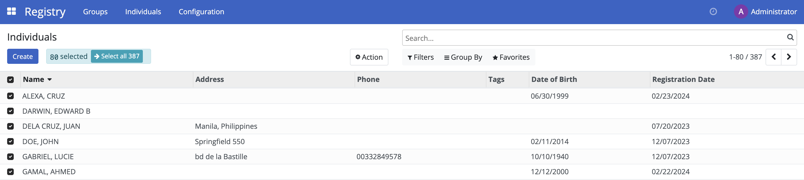
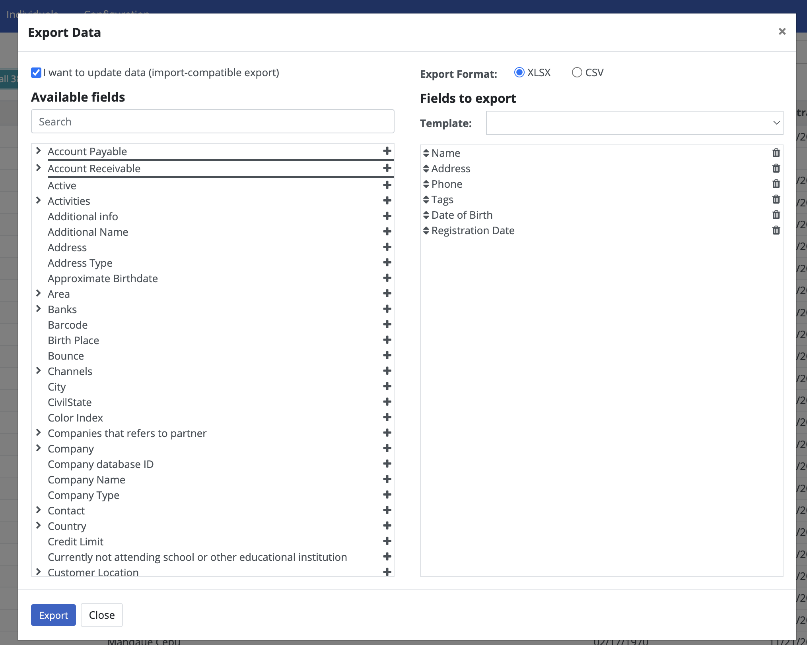
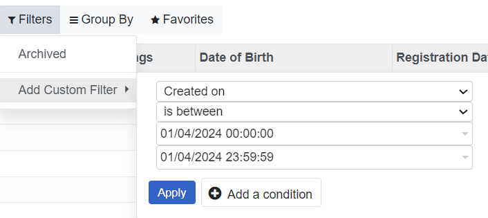
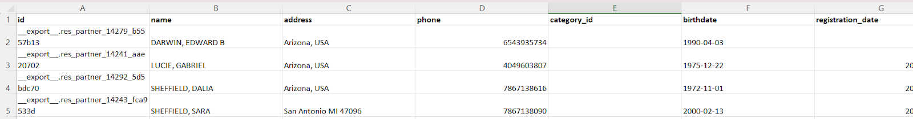
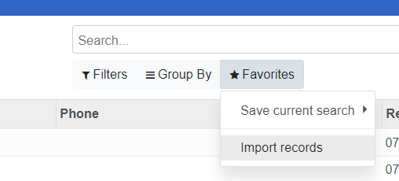
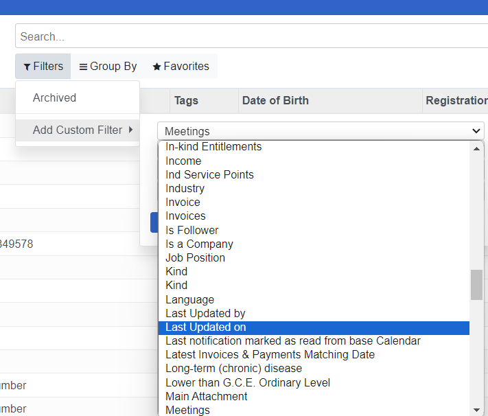
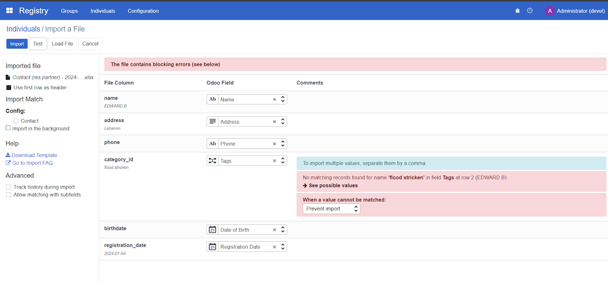
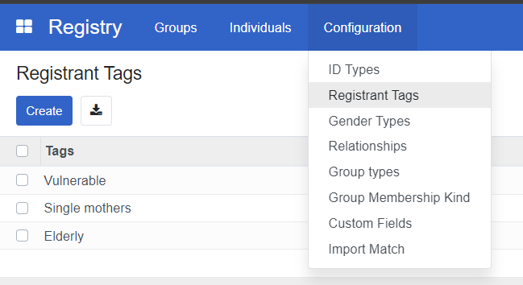
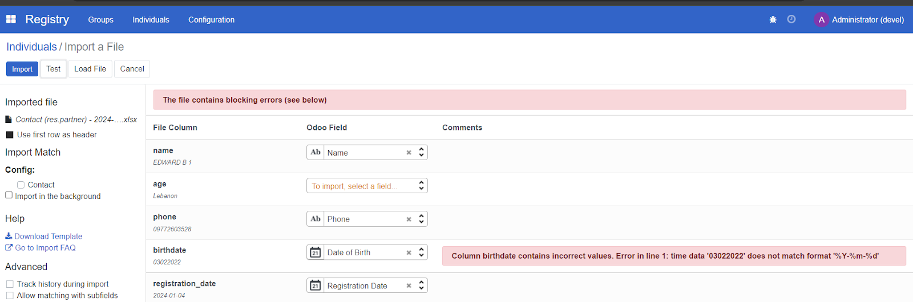
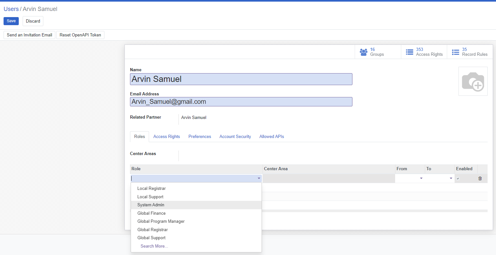

### Content from docs/howto/user_guides/export_registrant_data.md

# Export Registrant Data

## Introduction

This guide details the process of exporting registrant data from OpenSPP. Exporting data is crucial for managing and analyzing the information of registrants effectively within the OpenSPP system.

## Prerequisites

In order to be able to export registrant data using OpenSPP, ensure the following:

- Have authorized access to the OpenSPP platform.
- Determine the specific fields relevant to the data you wish to export.

## Objective

Upon completing this guide, users will be able to successfully export data for individuals or groups from OpenSPP for multiple purposes, such as record keeping, importing to add new individuals or groups, or importing to update existing individuals or groups. Ensuring the data is in a usable format.

## Step-by-step

1. Log in to OpenSPP with an account that has admin rights. Learn how to set up roles and accounts here(yet to be published).

2. When logged in successfully, you will be redirected to the **Registry** page. If it does not take you directly to the **Registry**, click the four-square icon on the top-left corner to bring up the menu, and then select **Registry**.

3. It is possible to export either **Groups** or **Individuals** depending on the needs. Navigate to the wished export level by clicking either **Groups** or **Individuals** in the top navigation bar.

4. Select the checkboxes to the left of the entries you want to export.

- If your aim is to export for the purpose of record-keeping, click on the checkboxes you wish to export or click checkbox beside **Name** header to select all records on the current page, additionally, If there are more records than can be displayed on the page, they can be selected by clicking **Select all**.

- If your aim is to export for the purpose of obtaining necessary fields as headers to be able to import to add new individuals or groups, select and click on the checkbox for at least one of the records from the list. Your aim during export is to select headers that are relevant to your import and it is therefore only necessary to export one record from groups or individuals to obtain the fields as headers already configured into the exported excel file.
- If your aim is to export for the purpose of import to update existing individuals or groups, select and click on the checkbox on the records you wish you update.

5. Navigate to the **Action** menu and select **Export**. This will display a popup window titled **Export Data**, where the export should be configured.

- If your aim for the import is to update existing individuals or groups, select and click the checkbox **I want to update data (import-compatible export)**. This will disable all options in **Available fields** that cannot be used for updates and will automatically include an external Id column in the exported file. Otherwise, skip this step.
- Select **XSLX** or **CSV** as export format.
- In the **Available fields** section, choose the fields you want to export by clicking on the **+** icon. To remove selected fields, click the trash icon beside the field name under the **Fields to export** column.

6. Click **Export** to download the file.

- Perform the export process carefully to ensure the data is exported in a usable format and stored securely to prevent unauthorized access.

### Content from docs/howto/user_guides/import_registrant_data.md

# Import registrant data

## Introduction

In this how-to guide, you will learn the process of importing registrant data in CSV or Excel format using the OpenSPP platform. The how-to guide covers the import of new data as well as the update of existing data.

## Prerequisites

To import registrant data into the OpenSPP, you need to:

- Ensure you have a user account with admin access to the OpenSPP platform. Learn more in this how-to: [How to-Administrating role-based access](https://docs.openspp.org/howto/user_guides/administrating_role_based_access.html)
- Prepare registrant data in CSV (Comma-Separated Values) or XLSX (Excel) format.
- Have access to spreadsheet software capable of editing and saving CSV or Excel files, such as Microsoft Excel.

## Objective

After performing this task, you will have successfully imported new or updated existing registrant data into OpenSPP, which will ensure an effective, efficient, and targeted delivery of social protection services. You will also gain proficiency in handling data imports, a crucial aspect of system administration in OpenSPP.

## Step-by-step

### Import to add new individual or group

In order to perform an import, the correct headers need to be used. The easiest way to correctly obtain this is to export a record from the system with the headers that should be used for the import.

1. To export an individual or group, follow the steps in [Export Registrant Data](https://docs.openspp.org/howto/user_guides/export_registrant_data.html).

2. Once you have successfully downloaded the exported file, it will have a format similar to the below screenshot. Which headers are included will depend on the fields selected in the export; this example displays one individual data exported. Keep only the headers in row **1**, and delete all other rows.

3. Format to Text all empty fields for columns that contain numeric values

- To format cells to text, locate a field header with a numeric value, for instance, Columns **C**, **E**, and **F**, on the screenshot Excel document.
- Click on the column header. Once highlighted, right-click, select, and click **Format Cells**; then select **Text** and click **OK**.
- Repeat on columns with numbers as values.

4. Fill in the fields with values accordingly. Please take note of the following:

- Leaving a cell empty will overwrite the corresponding field with a blank value in OpenSPP once it is successfully imported.
- Date format accepted by OpenSPP is YYYY-MM-DD only.

5. Launch OpenSPP and navigate to **Registry**, then click **Individuals** or **Groups** depending on the type of data, and then click **Favorites**. Select **Import records** from the displayed dropdown.

6. Locate the file prepared for upload and click **Upload File**. You will then be redirected to the screen below.

Make sure to click the checkbox for **Import in the background** when importing large files.

7. Click **Test**; this will validate the file to ensure the import document data is valid. If the message **Everything seems valid** is displayed, it is possible to proceed with the import.

If there are any issues with the file, a message will instead be displayed giving directions on how to solve the issue. You may refer to the **Error handling** section of this document to learn more about common errors.

8. When you click **Import**, a notification will appear displaying the number of successfully imported records.

9. Verify uploaded records by clicking filter and select **Created on**, then click **Apply**. Newly created records should be displayed in the registry list.

### Import to update existing individual or Group

To update existing records, select the desired existing records from OpenSPP and export them. Edit the values you wish to update in the exported file, then import it back to OpenSPP. The reason for exporting is to obtain the **unique id** for each record that is needed to perform an update.

1. To export an individual or group, follow the steps in [Export Registrant Data](https://docs.openspp.org/howto/user_guides/export_registrant_data.html).

2. Once you have successfully downloaded the exported file, open it and keep the **id** column in place; this serves as the identifier of the record when imported back to OpenSPP.

3. Replace values in the other headers you wish to update, then save the file. Please take note of the following:

- Leaving a cell empty will overwrite the corresponding field in OpenSPP with a blank value once it is successfully imported.
- The date format accepted by OpenSPP is YYYY-MM-DD only.
- If you encounter formatting errors when inputting number values, format the whole column to text by clicking the column header; once highlighted, right-click, select, and click **Format Cells**; then select **Text** and click **OK**.
- You can now fill the cell with the desired numeric value.

4. Launch OpenSPP, navigate to **Registry**, and click either **Individuals** or **Groups**, depending on which type of data you wish to import. Click **Favorites** and select **Import records**.

5. Locate your file and click **Upload file**. You will then be redirected to the screen below. Make sure to click the checkbox for **Import in the background** when importing large files.

6. Click **Test**; this will validate the file to ensure the import document data is valid. If the message **Everything seems valid** is displayed it is possible to proceed with the import.

If there are any issues with the file, a message will instead be displayed giving directions on how to solve the issue. You may refer to the **Error handling** section of this document to learn more about common errors.

7. Click **Import**, a notification will appear displaying the number of successfully imported records.

8. Verify uploaded records by clicking **Filters** and selecting **Last updated on**, then click **Apply**. Newly created records should display in the registry list.

### Error handling

Several errors can occur during import, depending on the setup and the imported data. It is impossible to cover all possible errors here, but some of the more common ones are listed below.

### No matching records found

Some fields require values that are predefined in OpenSPP, such as the **category_id** field. Setting a value in this column that does not match the values found in OpenSPP will return an error message similar to the screenshot below.

To resolve this type of error, only type in values that are defined in OpenSPP, in this case for **category_id**, You can navigate to **Registry**, then click **Configuration**, and after that, select **Registrant Tags**. You should see the list of the defined **Tags**, Only use these values from the list for **category_id**.

### To import, select a field

If OpenSPP could not recognize your header, it will display **To import, select a field** beside the unrecognized header, similar to the screenshot below.

To resolve this error, if you are familiar with what field you want to associate with your header, you can click **To import, select a field,** and then select from the list of fields; otherwise, you can remove the whole column associated with the header from your excel file as the field you are trying to import is not available to be imported into OpenSPP.

### Column contains incorrect values

Another error is the date format. If the imported format for fields related to date is incorrect, OpenSPP will display an error message similar to the below screenshot.

To resolve this error, change the date format from your Excel file to this format YYYY-MM-DD, save the file, then import it to test again.

### You are not allowed to access ‘Import Matching’

An issue encountered when attempting to import using an account with wrong access rights permissions would look like the below screenshot.

To resolve the error, assign a **System Admin** in the **Role** column to the user account that will perform the import or export process.

Learn more about administering permissions here [Administrating role-based access](https://docs.openspp.org/howto/user_guides/administrating_role_based_access.html).

### Content from docs/tutorial/user_guides/export_registrant_data.md

# Export Registrant Data

## Introduction

In this tutorial, you will learn how to export registrant data from OpenSPP.

## Prerequisites

To be able to export registrant data from OpenSPP, the following is required:

- Authorized administrative access to the OpenSPP platform.
- Determine the list of fields relevant to the data you wish to export.

## Objective

By the end of this tutorial, you should understand the purpose and process of exporting registrant data from OpenSPP. You'll learn how to extract and save registrant data in a specified format for various purposes, such as data analysis, record keeping, or migration to another platform.

## Process

To access the export feature, you must log in to OpenSPP with a System Admin role account since the functionality is not included for other roles. Learn how to set up roles and accounts in here Administrating role-based access(yet to be published).

### Specify export parameters

Specifying export parameters is done in the Registry section of OpenSPP, which you can access by clicking on the four-square icon in the top-left corner and selecting **Registry**.

Depending on your needs, you can export data for **Groups** or **Individuals**. The export procedure is identical in both cases, but the exportable fields differ.

Navigate to either **Groups** or **Individuals** and select which records to export by clicking the checkboxes beside each record. To select all displayed records, click the checkbox beside **Name**. If you want to export more records than are displayed on the page, select them by clicking **Select all**.

After selecting the records, click the **Action** button and select the **Export** action from the list of actions.

Two formatting options are available when exporting data: **CSV** and **XLSX**. Which one to select depends on how you will use the exported file.

The left column displays all data fields available for export, and the right column (**Fields to export**) shows the fields included in the file export. Some fields are pre-selected by default, such as **Name, Address, Phone**, etc. Examples of fields include date of birth, registration date, program types, or demographic information. Select the fields you would like to export by clicking the **+** icon. Fields indicated with an arrow > also contain subfields to narrow down the data you want to export. Clicking the arrow will display the subfields available for selection. You can remove fields in the **Fields to export** column by clicking the trash icon. Depending on your requirements, you can add any fields available for export in the left column.

Once you are satisfied with the selected fields in the right column, click the **Export** button at the bottom of the export window to start the export.

### Export to add or update existing data

If you aim to update existing or add new data in OpenSPP, tick the checkbox **I want to update data (import-compatible export)**. By ticking this checkbox, a column **Id** is automatically included in the exported file, containing the external identifier value of each **registrant** or data. This value identifies the existing registrant when performing a data update to allow for updating its other **fields**. By ticking this checkbox, some fields will be automatically hidden and made unavailable for export; this limits you to the fields you can update in OpenSPP.

### Creating export templates

Create a template for the set of fields that you have selected to make it use to perform the same export later.

By clicking on the dropdown arrow, click on **New template**, set a name for your template, make sure you have already selected your desired fields for this template, and click the save icon.

After saving, you can select your template by clicking on the dropdown arrow again and clicking the name of your template.

The specific steps and interface may vary depending on the OpenSPP version. Always seek assistance from the support team if you need further guidance.

### Content from docs/tutorial/user_guides/import_registrant_data.md

# Import registrant data

## Introduction

In this tutorial, you will learn the process of importing registrant data in CSV or Excel format using the OpenSPP platform. The tutorial covers the import of new data, as well as the update of existing data.

## Prerequisites

To import registrant data into the OpenSPP, you need to:

- Ensure you have a user account with admin access to the OpenSPP platform. Learn more in this tutorial:[Administrating role-based access](https://docs.openspp.org/tutorial/user_guides/administrating_role_based_access.html)
- Prepare registrant data in CSV or Excel format.
- Have access to spreadsheet software capable of editing and saving CSV or Excel files, such as Microsoft Excel.

## Objective

This tutorial aims to instruct users on how to efficiently manage registrant import within the OpenSPP system. It includes steps for importing substantial data volumes from CSV or Excel files, essential for incorporating new beneficiaries as programs grow.

## Process

The import process consists of logging in to OpenSPP with an admin user account, navigating to the registry, exporting registrants to obtain the correct file format, updating the values in the file, and importing it back into OpenSPP.

### Login with proper user access rights

To prevent data mishandling and improve data security, the permission to import and export data into OpenSPP is exclusive to user accounts with **System admin** role. Learn more about setting up and configuring admin role user accounts here [Administrating role-based access](https://docs.openspp.org/tutorial/user_guides/administrating_role_based_access.html). To verify that your user account has the right permissions, navigate to the four-square icon on the top-left corner and click **Settings** from the list, click **Users & Companies** from the header; then click **Users**. This should display all user accounts in OpenSPP.

Click on the row of the user account and make sure that the **System Admin** role is set under the **Roles** tab.

This indicates you have the correct access rights to perform **import** and **export**.

### Export records to obtain necessary headers

Exporting records is associated with import, as it guides you on which **fields** are available to use when you want to add or update information.

If the import aims to add a new individual or group (as opposed to updating already existing data), you should export headers that are relevant to your import. You only need to export one record from groups or individuals to obtain the correct headers to use. See below for an example of a file with the relevant headers and a single record.

If the import aims to update already existing individuals or groups, you need to obtain the reference ID for all the records that should be updated and export them. See below an example of a file with headers and multiple records which all include the column for ID.

To produce a file that includes the reference and all other fields mandatory for the update, tick the checkbox for **I want to update data (import-compatible export)** in the export dialogue box. Selecting this checkbox also removes fields that cannot be imported back to OpenSPP from **Available fields**. An example of such a field is **Age**, which is a calculated field based on the **Date of Birth** of the individual and therefore cannot be updated through import.

These unique identifiers are associated with each of the records. When you import the Excel file back into OpenSPP after you have updated your desired fields, make sure the values for the fields you updated only affect the ones you intend to import.

Learn more about export registrant data in Tutorial: [Export Registrant Data](https://docs.openspp.org/tutorial/user_guides/export_registrant_data.html)

### Preparing file for import

To add new individuals or groups, prepare the Excel file for import by converting cells to text for all fields that consist of numbers; for instance, **phone, date of birth, and registration date**. This is to avoid data errors when inputting number values into these fields. For example the **phone field**, where mobile numbers may start with the + symbol or with leading zeroes can cause a mobile number to be formatted unexpectedly. It is therefore important to format cells to text before adding number values. Also note that when saving the file, only CSV and XLSX formatted files are allowed for import.

To update existing individuals or groups, open the exported Excel file and modify the cells you wish to update. Note that you should only format specific cells to text if your values break upon input. As in the image below, inputting a phone number with a leading + symbol is automatically formatted. In this case, you should format the specific cell to **Text** to resolve the issue.

### Perform import

After the file is verified and ready, the import can be performed using an admin account. Navigate to the **Registry**, and depending on what type of data you are going to import, either click **Individuals** for individual records or **Groups** for group records. Click on the **Favorites** icon, then choose **Import records** from the dropdown menu. You will be redirected to the upload page. Click on the **Load File** button, and choose the file that you prepared. After uploading your file, you will be redirected to the page below.

Click **Test**; this will validate the data in the import document. If the message **Everything seems valid is displayed**, it is possible to proceed with the import.

If there are any issues with the file, a message will instead be displayed giving directions on how to solve the issue. You may refer to the **Error handling** section of this document to learn more about common errors.

When the file is considered valid, it is possible to click the **Import** button. This will redirect to the main table page, and you will receive a notification informing that the records have been successfully imported.

### Error Handling

OpenSPP displays different types of error messages on the import page when encountering an error after clicking the **Test** button. This ensures no invalid value or file would compromise data in OpenSPP. Therefore, it is important to always **Test** the file first before importing. Here are common errors encountered during import.

### No matching records found

Some fields require values that are predefined in OpenSPP, such as the **category_id** field. Setting a value in this column that does not match the values found in OpenSPP will return an error message. This error will be similar to the screenshot provided below.

To resolve this type of error, only type in values that are defined in OpenSPP, in this case for **category_id**, you can navigate to **Registry**, then click **Configuration**, and after that, select Registrant **Tags**. You should see the list of the defined Tags. Only use these values from the list for **category_id**.

### To import, select a field

If OpenSPP could not recognize your header, it will display **To import, select a field** beside the unrecognized header, similar to the screenshot below.

To resolve this error, if you are familiar with what field you want to associate with your header, you can click To **import, select a field**, and then select from the list of fields you wish to associate your field values with, otherwise, you can remove the header from your excel file as the field you are trying to import is not available to be imported into OpenSPP.

### Column contains incorrect values

Another error is the date format, if the imported format for fields related to date is incorrect, OpenSPP will display an error message. This error will be similar to the screenshot provided below.

To resolve this error, fix the date format from your Excel file to this format **YYYY-MM-DD**, save the file, then import to test again.

### You are not allowed to access ‘Import Matching’

An issue was encountered when attempting to import using an account with the wrong access rights permissions. This error will be similar to the screenshot provided below.

To resolve this error, assign an admin role into the user account that will perform the import or export process. Learn more about administering permissions here [Administrating role-based access](https://docs.openspp.org/tutorial/user_guides/administrating_role_based_access.html).
