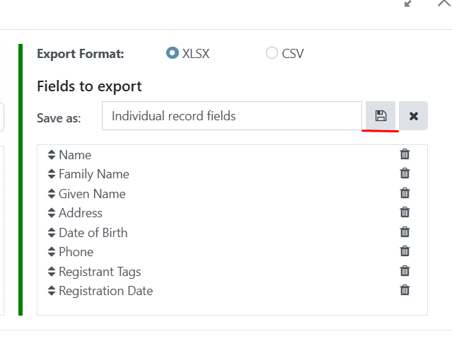
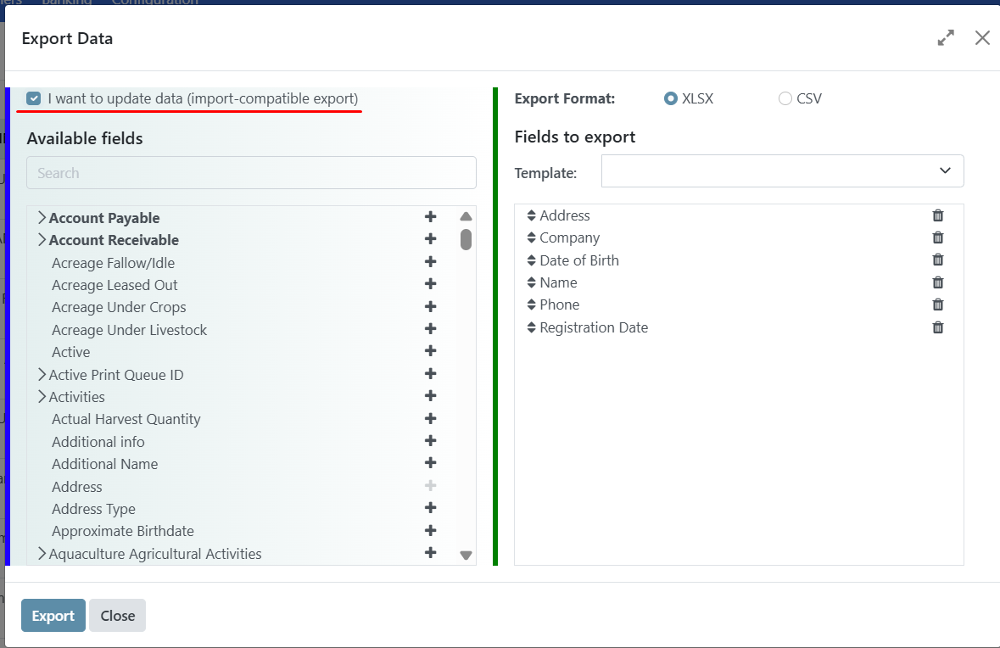
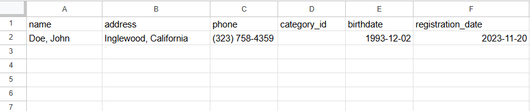
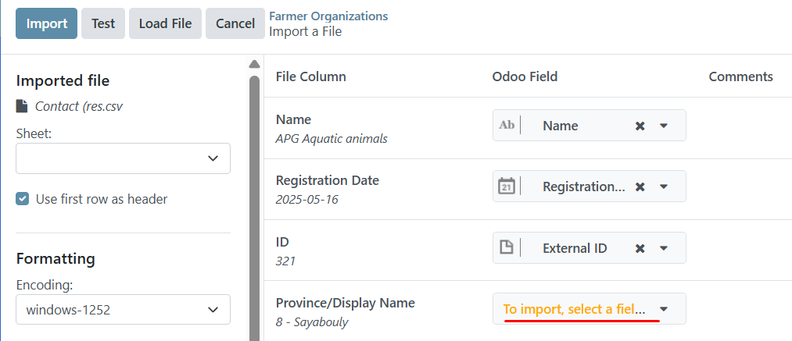
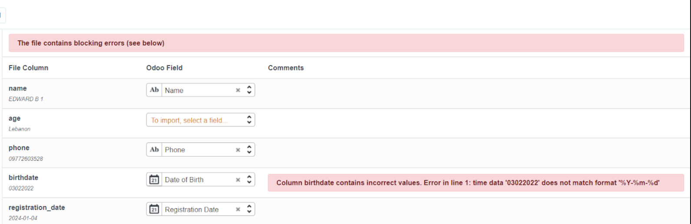

# Import and Export Registrant Data

## Introduction

This guide offers a comprehensive, step-by-step overview of the process for exporting registrant data from OpenSPP. It details the procedures, configurable options, and considerations available to system administrators, including how to use the export functionality to prepare files for re-import into OpenSPP.

## Prerequisites

To be able to import or export registrant data from OpenSPP, the following is required: 

- Ensure you have a user account with admin access to the OpenSPP platform. Learn more in this guide: {doc}`../administration/user_access`.
- Have access to spreadsheet software capable of editing and saving CSV or Excel files, such as Microsoft Excel or Google Sheets
- Determine the list of fields relevant to the data you wish to export.

## Objective

By the end of this tutorial, you will have a clear understanding of the purpose and procedure for exporting registrant data from OpenSPP. You will be equipped to extract and save registrant information in a defined format, suitable for a range of applications including data analysis, archival, platform migration, or preparing files for re-import into OpenSPP using the import functionality.

## Process

The process involves selecting existing individual or group records to export, defining export parameters, and saving the file as either **CSV** or **XLSX**. This exported file can be used for record-keeping or for importing registrant data back into OpenSPP.

### Perform export registrant

Specifying export parameters is done in the Registry section of OpenSPP, which you can access by clicking on the menu icon in the top-left corner and selecting **Registry**.

Depending on your needs, you can export data for **Groups** or **Individuals**. The export procedure is identical in both cases, but the exportable fields differ.

Navigate to either **Groups** or **Individuals** and select which records to export by clicking the checkboxes beside each record. To select all displayed records, click the checkbox beside **Name**. If you want to export more records than are displayed on the page, select them by clicking **Select all**.

### Define Export parameters

After selecting the records, click the **Action** button and select the **Export** action from the list of actions.

Two formatting options are available when exporting data: **CSV** and **XLSX**. Which one to select depends on how you will use the exported file.

The left column displays all data fields available for export, and the right column (**Fields to export**) shows the fields included in the file export. Some fields are pre-selected by default, such as **Name**, **Address**, **Phone**, etc. Examples of fields include date of birth, registration date, program types, or demographic information. 

Select the fields you would like to export by clicking the **+** icon. Fields indicated with an arrow **>** also contain subfields to narrow down the data you want to export. Clicking the arrow will display the subfields available for selection. You can remove fields in the **Fields to export** column by clicking the trash icon. Depending on your requirements, you can add any fields available for export in the left column. 

Once you are satisfied with the selected fields in the right column, click the **Export** button at the bottom of the export window to start the export and download the file.

### Creating export templates

Create a template for the set of fields that you have selected to make it easy to perform the same export later. 
By clicking on the dropdown arrow, click on **New template**, set a name for your template, make sure you have already selected your desired fields for this template, and click the save icon.

After saving, you can select your template by clicking on the dropdown arrow again and clicking the name of your template.
The specific steps and interface may vary depending on the OpenSPP version. Always seek assistance from the support team if you need further guidance.

### Perform Import

#### Import to update existing registrant data

To update existing records or append new data within OpenSPP, select the checkbox labeled I want to update data (import-compatible export). Upon selection, the exported file will automatically include an Id column, which contains the external identifier for each registrant or data entry. This identifier is essential for accurately matching and updating existing records. Additionally, enabling this option will exclude certain fields from the Available fields list—specifically those that cannot be re-imported into OpenSPP. For instance, the Age field is omitted, as it is a derived value based on the Date of Birth and therefore not eligible for direct modification via import.

 See below an example of a file with headers and multiple records which all include the column for ID.

After exporting your file, you may proceed to edit the values as needed.

You can then proceed to **Preparing file for import**.

#### Import to add new registrant data

If the export aims to add a new individual or group (as opposed to updating already existing data), you should export headers that are relevant to your import. See **Define export parameters** section of this document to learn more. You only need to export one record from groups or individuals to obtain the correct headers to use. See below for an example of a file with the relevant headers and a single record.  

Then once the headers are finalized, you can add data under the associated column headers.

You can then proceed to **Preparing file for import**.

### Preparing file for import

To add new individuals or groups, prepare the Excel file for import by converting cells to text for all fields that consist of numbers; for instance, **phone**, **date of birth**, and **registration date**. This is to avoid data errors when inputting number values into these fields. For example the **phone field**, where mobile numbers may start with the **+** symbol or with leading zeroes can cause a mobile number to be formatted unexpectedly. It is therefore important to format cells to text before adding number values. Also note that when saving the file, only CSV and XLSX formatted files are allowed for import.

To update existing individuals or groups, open the exported Excel file and modify the cells you wish to update. Note that you should only format specific cells to text if your values break upon input. As in the image below, inputting a phone number with a leading + symbol is automatically formatted. In this case, you should format the specific cell to **Text** to resolve the issue. 

### Navigate to import page

After the file is verified and ready, the import can be performed using an admin account. Navigate to the **Registry**, and depending on what type of data you are going to import, either click **Individuals** for individual records or **Groups** for group records. Click on the **Gear** icon, then choose **Import records** from the dropdown menu. 

 

You will be redirected to the upload page. Click on the **Upload File** button, and choose the file that you prepared. After uploading your file, you will be redirected to the page below. 

 

Click **Test** to initiate validation of the data in the import document. If the message **Everything seems valid** appears, you may continue with the import process.

If there are any issues with the file, a message will instead be displayed giving directions on how to solve the issue. You may refer to the **Error handling** section of this document to learn more about common errors. 

When the file is considered valid, click the **Import** button. This will redirect to the main table page, and you will receive a notification informing that the records have been successfully imported. 

### Error Handling

OpenSPP displays different types of error messages on the import page when encountering an error after clicking the **Test** button. This ensures no invalid value or file would compromise data in OpenSPP. Therefore, it is important to always **Test** the file first before importing. Here are common errors encountered during import.

#### Error: "No matching records found"

Some fields require values that are predefined in OpenSPP, such as the **category\_id** field. Setting a value in this column that does not match the values found in OpenSPP will return an error message. This error will be similar to the screenshot provided below.  

To resolve this type of error, only type in values that are defined in OpenSPP, in this case for **category_id**, you can navigate to **Registry**, then click **Configuration**, and after that, select **Registrant Tags**. You should see the list of the defined **Tags**. You may use any of the listed values for **category_id**, or alternatively, add a new registrant tag.

#### Error: "To import, select a field"

If OpenSPP could not recognize your header, it will display **To import, select a field** beside the unrecognized header, similar to the screenshot below.  

To resolve this error, if you are familiar with what field you want to associate with your header, you can click **To import, select a field,** and then select from the list of fields you wish to associate your field values with, otherwise, you can remove the header from your Excel file as the field you are trying to import is not available to be imported into OpenSPP.

#### Error: "Column contains incorrect values"

Another error is the date format, if the imported format for fields related to date is incorrect, OpenSPP will display an error message. This error will be similar to the screenshot provided below.  

To resolve this error, fix the date format from your Excel file to this format **YYYY-MM-DD**, save the file, then import to test again.

#### Error: "You are not allowed to access ‘Import Matching’"

An issue was encountered when attempting to import using an account with the wrong access rights permissions. This error will be similar to the screenshot provided below.  

To resolve this error, assign an admin role into the user account that will perform the import or export process. Learn more about administering permissions here: {doc}`../administration/user_access`.
