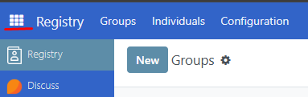
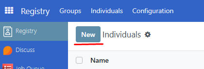
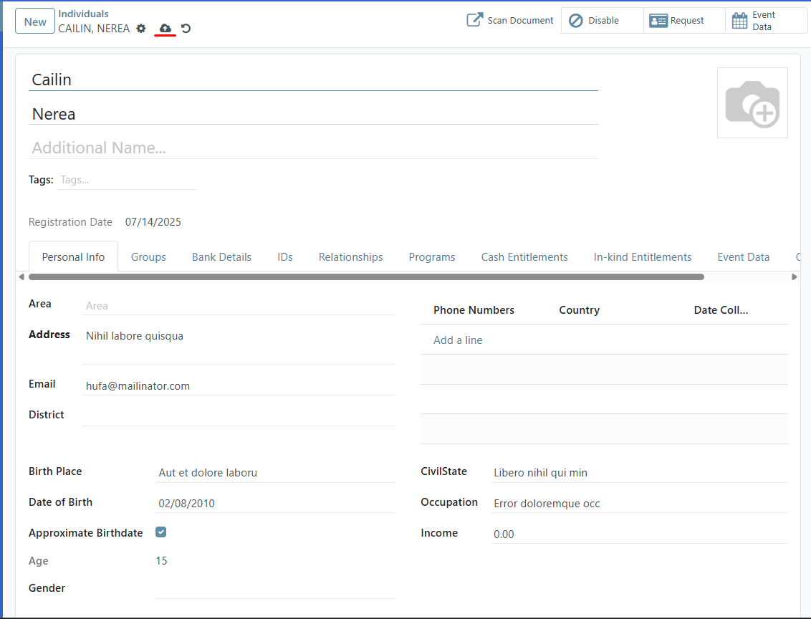
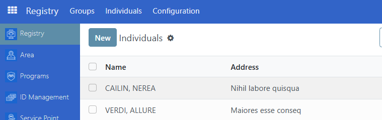
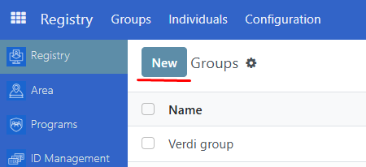
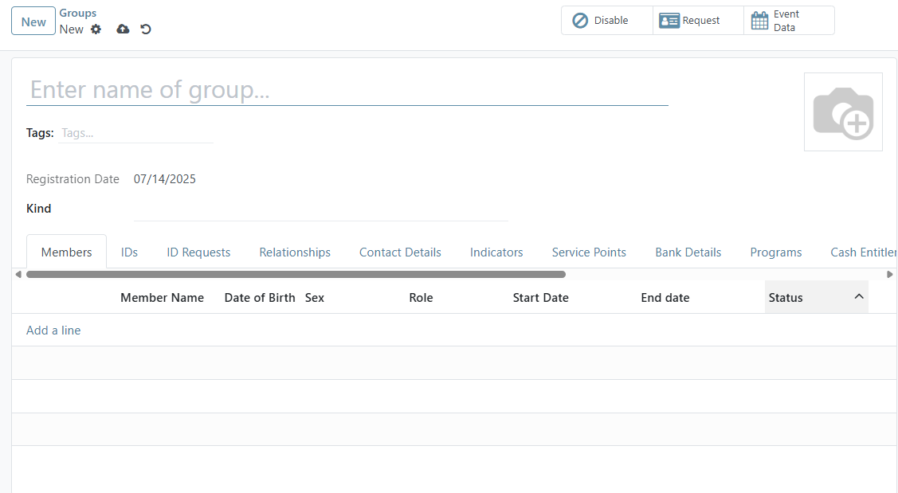
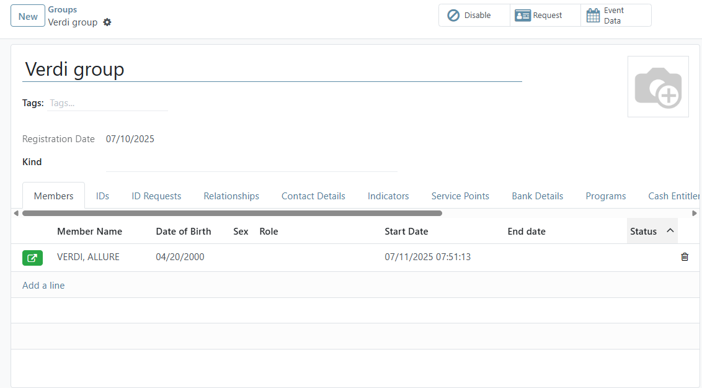
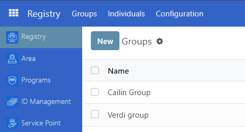
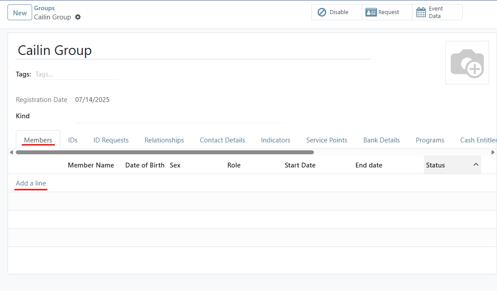
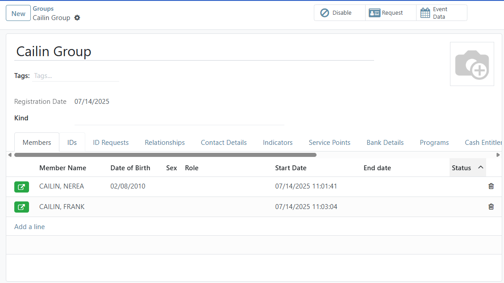

# Register new individual

## Introduction

To integrate new individual information into the system and store it in the registry. A registrant becomes a beneficiary only after enrollment in a social protection program. The registration process is a critical component in the efficient administration of social protection, utilizing the recorded information to identify individuals, evaluate their needs, confirm their eligibility for social protection programs and other social services, and accurately determine benefit amounts. Initiatives for mass registration may occur at the start of a new program or during the creation of a new registry. Furthermore, new applicants can be added to existing programs or registries continuously.

## Prerequisites

To register an individual for OpenSPP, you need to:

- Ensure that you have the necessary user permission.
- Prepare the required data for the individual.

## Objective

By the end of this tutorial, you should be able to register new individuals on the OpenSPP platform and add new individuals to groups.

## Process

### Registering new individuals

Click on the menu icon in the top-left corner. Select **Registry** then click **Individuals**.

Click on **New** to be directed to the registration interface for new applicants

Enter the necessary values for the individual as required by your programme. After verifying the entered information, click the **Save** icon to complete the registration process.

The record of the new individual is now displayed in the **Individuals** list in the **Registry** page.

### Creating new group

Navigate to **Registry** then click **Groups**. Click on **New**.

You will be directed to the registration interface for new **Groups**.

After ensuring all the information is correctly entered, click the **Save** icon to complete the registration process.

The record of the new group is now displayed in the **Groups** list in the **Registry** page.

### Adding new individual to group

Select the group to which you want to add an individual. Click **Add a line** under **Members** tab, then choose the individual from the list. Repeat this step to add additional individuals as needed.

Click the **Save** icon to complete the changes. The newly added individual(s) is displayed.

