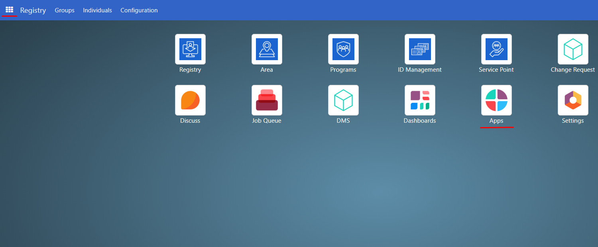
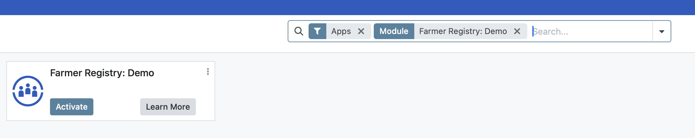
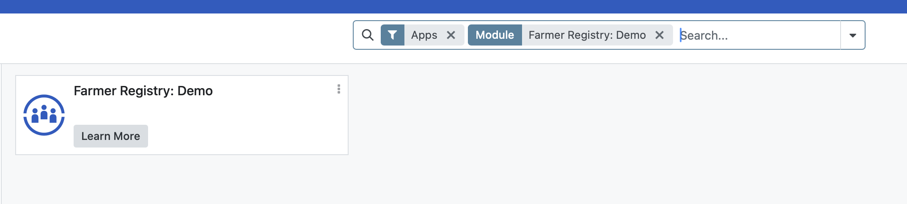
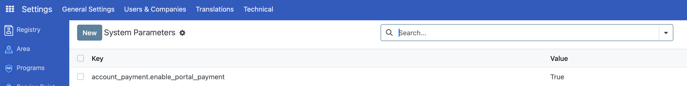
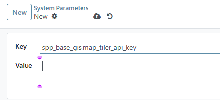
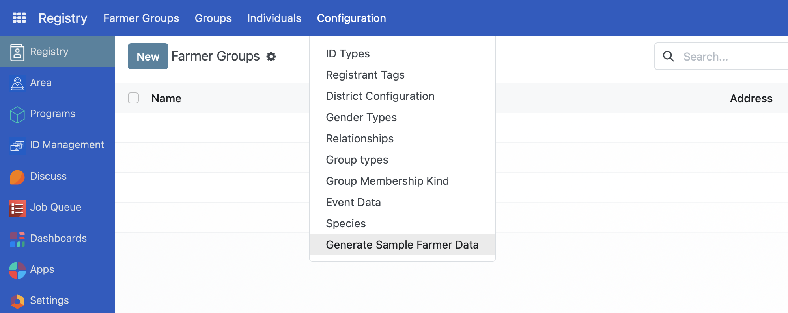
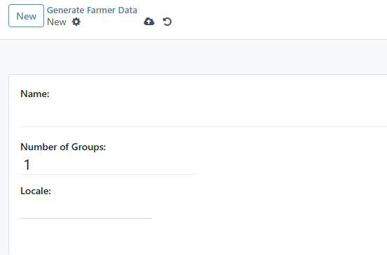
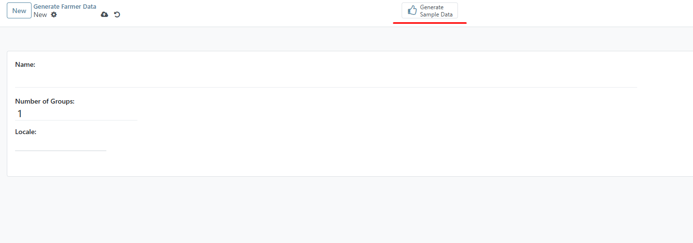

# Setting up Farmer Registry

## Introduction

This guide provides step-by-step instructions for installing the Farmer Registry module in OpenSPP and configuring it to generate sample farmer data. The module extends OpenSPP with features for farmer registration and management.

## Prerequisites

Before you begin, ensure you have the following:

- An API Key for MapTiler to enable GIS functionality. You can retrieve this by checking their documentation [here](https://docs.maptiler.com/cloud/api/).
- Developer mode of OpenSPP should be enabled to set up the MapTiler key.

## Objective

By the end of this guide, you will be able to set up the farmer registry.

## Process

### Installing the Farmer Registry

Log in to OpenSPP, click on the menu icon, and then click Apps.

2. Search for Farmer **Registry: Demo** and click **Activate** to install it. This will also install the prerequisite modules.

3. Note that after installation, the button **Activate** will disappear.

### Setting Up the API Key for MapTiler

1. Go to **Settings**, select **Technical** and click **System Parameters**.

2. Click the **New** button and set the Key field to **spp_base_gis.map_tiler_api_key** and enter the actual API Key for MapTiler in the **value** field.

3. Click the **Save** icon.

### Generating Sample Farmer Data

1. Navigate to **Registry** from the top toolbar.

2. Select **Configuration** and click on **Generate Sample Farmer Data**.

3. Click **New**. On the displayed screen, create a label or name for this sample data in the **Name** field and enter the desired number of groups in the field **Number of Groups**.

4. Click the **Generate Sample Data** button located at the top-center of the page. This will populate the registry with sample farmer data.

