---
myst:
  html_meta:
    "title": "Change Requests"
    "description": "Guide to updating registrant information in OpenSPP using the Change Request module with role-based approval workflows."
    "keywords": "OpenSPP, change requests, registrant updates, approval workflow, validation, data management"
---

# Change Requests

This guide explains how to update registrant information in OpenSPP using the Change Request module.
The process follows a defined workflow, requiring users with specific roles to initiate and validate requests.
Permission-based access and thorough documentation help ensure data accuracy and reliable operations.

## Prerequisites

Before submitting or approving change requests, ensure the following:
- Have existing individual records in your registry, either by creating records manually {doc}`register_individual` or importing records into OpenSPP {doc}`import_export_registrant_data`.
- Assign appropriate roles to Change Request validators.
  You can learn how to perform these tasks in the {doc}`../administration/user_access` document under the **Configuring Roles** section:
  - **Local Validator**: Add the group name under the Groups tab: `Change Request Module Access / Change Request Validator Local`.
  - **HQ Validator**: Add the group name under the Groups tab: `Change Request Module Access / Change Request Validator HQ`.
- Install the {doc}`spp_change_request </reference/modules/spp_change_request>` module (Change Request Module).
  Learn more in the **Installing Additional Modules** section of this guide: {doc}`../../getting_started/module_installation`.

## Objective

After completing this tutorial, you will be able to:
- Submit and validate change requests for registrant data.
- Navigate role-specific approval workflows.
- Attach supporting documentation and track updates efficiently.

## Process

To update a registry record, a change request is initiated by a System Administrator or Registrar.
The request is drafted, applicant information is updated for validation, and supporting documents are attached to have a reference for the updating of information.
Once submitted, the request undergoes validation by a Local Validator.
If approved, it proceeds to an HQ Validator for final review.
Upon HQ validation, the change request is applied to the applicant's record and can be verified through the registry.

### Creating a Change Request draft

Login as System Administrator or Registrar, then from the menu, click on **Change Request**.

   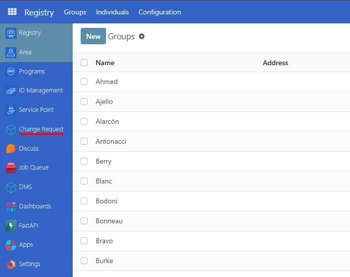

From the Change request page, click the **New** button.
Then fill in the request details:
- Request Type: Select Change Information.
- Registrant: Choose the registrant initiating the request.
- Applicant: Select the registrant whose data will be changed.
- Phone Number: Enter the registrant's contact number.

Click **Create** to proceed.
Clicking Create will generate a draft file for your change request.

 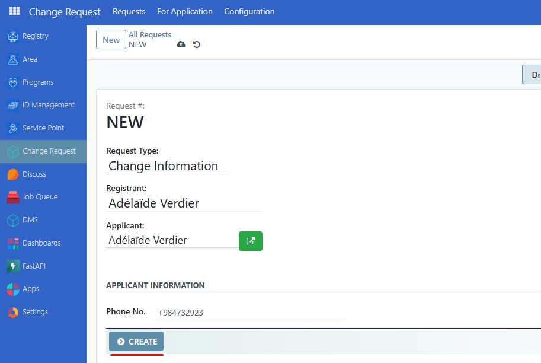

#### Updating Applicant Information

From the Change request page, select a **Change request** file currently in Draft state.

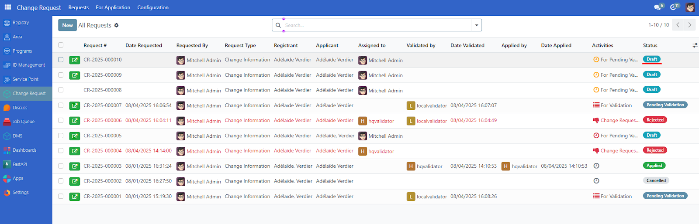

Click **Next**, then fill in the necessary fields.

* **Family Name** and **Given Name** are required.  
  * Input directly into the field data you wish to update.  
  * If you do not wish to update the field, leave it blank.

Please note that more fields may be displayed here depending on the specific configuration for your OpenSPP instance.

Navigate to the **Attachments** tab:

* Click **Request Form** *(required) then upload your file related with your information request.*  
* Optionally, attach **Birth Certificate** or **Other Documents** as reference for your change request update.

 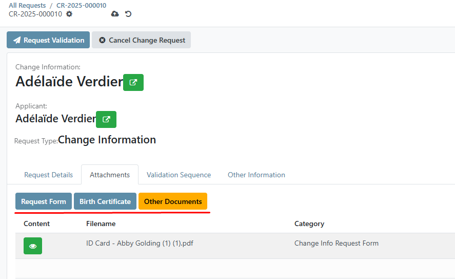

Click **Request Validation** to submit for approval.

### Validation Workflow

#### Review request by Local Validator Role

Log in using a **Local Validator** user account then go to **Change Request**.

Select the request and click **Assign to me**.

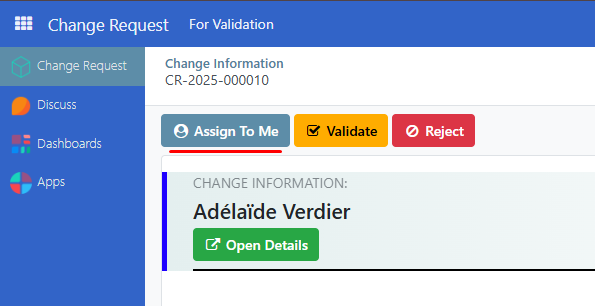

Review **Request details** and **Attachment** for uploaded files as reference for the change request.
Alternatively, you can review uploaded files in DMS (Directory Management System) feature.
Learn more in this guide: {doc}`dms`

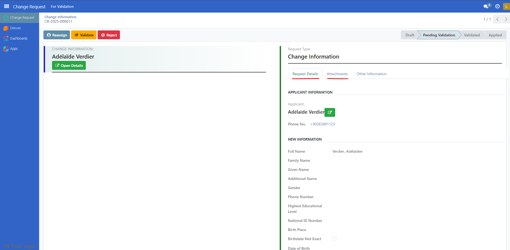

Click **Validate** to partially approve the change request.
A success notification will appear upon approval.
Otherwise, click reject to negate and cancel change request.

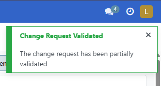

Partially approved change requests are then reviewed by users with HQ validator roles.

#### Review request by HQ Validator Role

Log in using a **HQ Validator** user account then go to **Change Request**.

Select a change request, review **Request details** and **Attachment** for uploaded files as reference for the change request. Alternatively, you can review uploaded files in DMS (Directory Management System) feature. Learn more in this guide: {doc}`dms`

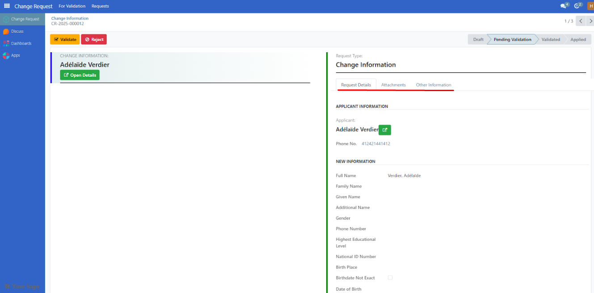

Click **Validate** to completely approve the change request. A success notification will appear upon approval. Otherwise, click reject to negate and cancel change request.

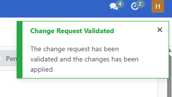

Change requests approved by **HQ validator** users are applied directly to the applicant’s records.

- Please note that change requests may be rejected by the **HQ validator** user even if they haven't been approved by a local validator user.  
- Please note that change requests cannot be validated by the **HQ validator** user unless they have been pre-validated by a **local validator** user.

###  Reviewing Changes

Log back in as Administrator or Registrar and go to Registry→Individual.

Click **search filter** dropdown.

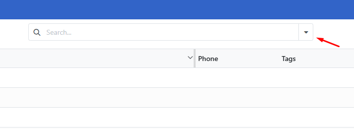

Click on **Add Custom Filter**.

- Filter by **Last Updated By \-**  to search by validator name. Define the relational operators. Then click on Add.  
 
 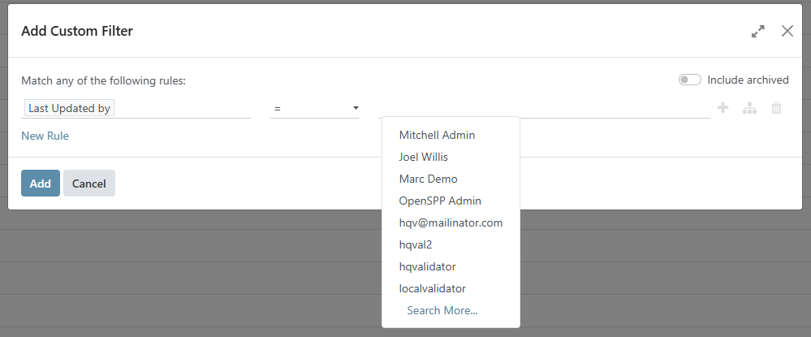

- Filter by **Last Updated On \-**  to search by updated date. Define the relational operators. Then click on Add.  

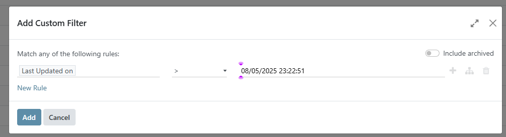

Verify that registrant changes are reflected in their profile.

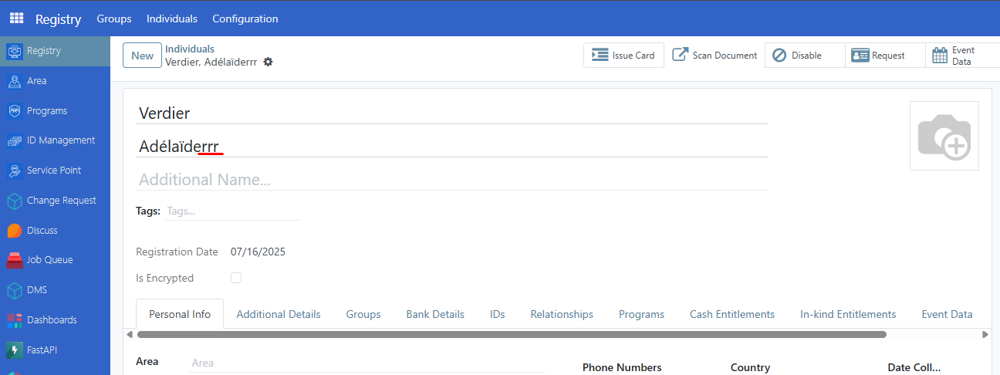